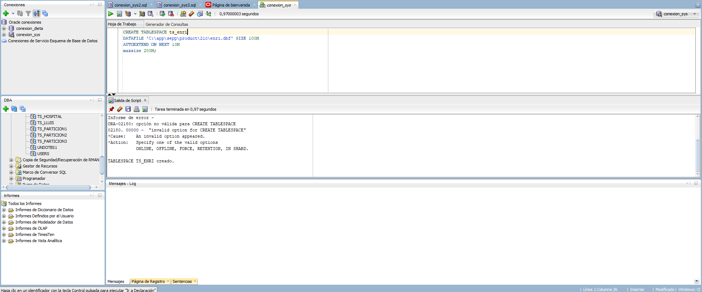

# Proyecto base de datos distribuída
<br>
<br>
<br>
<br>
<br>


<br>
<br>
<br>
<br>
<br>

<center>José Ramón Peris</center>
<center>Fecha: 27-01-2023</center>

---

<br>


## Creación de los tablespaces

En la primera parte crearemos los 7 tablespaces (ts_enric, ts_particion1, ts_particion2, ts_particion3, ts_compañero1, ts_compañero2, ts_compañero3)

**Muy importante**

ALTER SESSION SET "_ORACLE_SCRIPT"=TRUE;


CREATE USER jose IDENTIFIED BY 12345 

DEFAULT TABLESPACE ts_enric 

TEMPORARY TABLESPACE TEMP 

QUOTA 70M ON ts_enric; 

```sql
--TS_ENRIC
CREATE TABLESPACE ts_enric
DATAFILE 'C:\app\sepp\product\21c\enric.dbf' SIZE 100M
AUTOEXTEND ON NEXT 10M
maxsize 200M;

--TS_DRAC
CREATE TABLESPACE ts_drac
DATAFILE 'C:\app\sepp\product\21c\drac.dbf' SIZE 100M
AUTOEXTEND ON NEXT 10M
maxsize 200M;

--TS_LLUIS
CREATE TABLESPACE ts_lluis
DATAFILE 'C:\app\sepp\product\21c\lluis.dbf' SIZE 100M
AUTOEXTEND ON NEXT 10M
maxsize 200M;

--TS_HORTA
CREATE TABLESPACE ts_horta
DATAFILE 'C:\app\sepp\product\21c\horta.dbf' SIZE 100M
AUTOEXTEND ON NEXT 10M
maxsize 200M;

--TS_PARTICION1
CREATE TABLESPACE ts_particion1
DATAFILE 'C:\app\sepp\product\21c\particion1.dbf' SIZE 100M
AUTOEXTEND ON NEXT 10M
maxsize 200M;

--TS_PARTICION2
CREATE TABLESPACE ts_particion2
DATAFILE 'C:\app\sepp\product\21c\particion2.dbf' SIZE 100M
AUTOEXTEND ON NEXT 10M
maxsize 200M;

--TS_PARTICION3
CREATE TABLESPACE ts_particion3
DATAFILE 'C:\app\sepp\product\21c\particion3.dbf' SIZE 100M
AUTOEXTEND ON NEXT 10M
maxsize 200M;

```



## Creación de usuarios y permisos

Con los tablespaces ya creados, crearemos los usuarios.

```sql
--José
CREATE USER jose IDENTIFIED BY 12345 
DEFAULT TABLESPACE ts_enric 
TEMPORARY TABLESPACE TEMP 
QUOTA 70M ON ts_enric; 

-- Viktor
CREATE USER viktor IDENTIFIED BY 12345 
DEFAULT TABLESPACE ts_lluis 
TEMPORARY TABLESPACE TEMP 
QUOTA 70M ON ts_lluis;
-- Lautaro
CREATE USER lautaro IDENTIFIED BY 12345 
DEFAULT TABLESPACE ts_horta 
TEMPORARY TABLESPACE TEMP 
QUOTA 70M ON ts_horta; 

-- Jesús
CREATE USER jesus IDENTIFIED BY 12345 
DEFAULT TABLESPACE ts_drac
TEMPORARY TABLESPACE TEMP 
QUOTA 70M ON ts_drac; 
```


**Permisos**

El permiso de creación de tablas, luego lo revocaremos. 

```sql
--Jose
GRANT CREATE SESSION TO "jose"; 
GRANT CONNECT TO "jose"; 
GRANT DATABASE LINK TO "jose";
GRANT SELECT ANY TABLE TO "jose"; 
GRANT CREATE ANY TABLE TO "jose"; 
GRANT DELETE ANY TABLE TO "jose"; 
GRANT UPDATE ANY TABLE TO "jose"; 
GRANT INSERT ANY TABLE TO "jose";

--Viktor
GRANT CREATE SESSION TO "viktor" ; 
GRANT CONNECT TO "viktor"; 
GRANT SELECT ANY TABLE TO "viktor" ; 
GRANT CREATE ANY TABLE TO "viktor"; 
GRANT DELETE ANY TABLE TO "viktor" ; 
GRANT UPDATE ANY TABLE TO "viktor" ; 
GRANT INSERT ANY TABLE TO "viktor" ; 

--Lautaro
GRANT CREATE SESSION TO "lautaro"; 
GRANT CONNECT TO "lautaro"; 
GRANT SELECT ANY TABLE TO "lautaro"; 
GRANT CREATE ANY TABLE TO "lautaro"; 
GRANT DELETE ANY TABLE TO "lautaro"; 
GRANT UPDATE ANY TABLE TO "lautaro";
GRANT INSERT ANY TABLE TO "lautaro"; 

--Jesús
GRANT CREATE SESSION TO "jesus"; 
GRANT CONNECT TO "jesus"; 
GRANT SELECT ANY TABLE TO "jesus"; 
GRANT CREATE ANY TABLE TO "jesus"; 
GRANT DELETE ANY TABLE TO "jesus"; 
GRANT UPDATE ANY TABLE TO "jesus"; 
GRANT INSERT ANY TABLE TO "jesus"; 
```


## Creación de conexión y tablas

Ahora que tenemos los usuarios y los privilegios necesarios, nos disponemos a conectarnos con nuestro usuario y a crear la tabla para el dblink.


Ya nos hemos conectado con nuestro usuarios, ahora crearemos la tabla con las particiones.

```sql
CREATE TABLE ALUMNOS ( 
    NIA NUMBER(8) PRIMARY KEY, 
    dni VARCHAR2(9) , 
    nombre VARCHAR2(20),  
    ciudad VARCHAR2(15) DEFAULT 'Valencia',  
    telefono NUMBER(9),  
    ciclo VARCHAR2(20),  
    nota NUMBER(2,1) 
)  

PARTITION BY RANGE (NIA) (  
    PARTITION particion_1 VALUES LESS THAN (20000000) TABLESPACE TS_PARTICION1, 
    PARTITION particion_2 VALUES LESS THAN (40000000) TABLESPACE TS_PARTICION2,  
    PARTITION particion_3 VALUES LESS THAN (MAXVALUE) TABLESPACE TS_PARTICION3 
);  
```


**Inserción de datos**

```sql
    INSERT INTO ALUMNOS (NIA, dni, nombre, ciudad, telefono, ciclo, nota) VALUES  
    (10000001, '123456789', 'Juan', 'Madrid', 123456789, 'Informática', 7.5); 
    INSERT INTO ALUMNOS (NIA, dni, nombre, ciudad, telefono, ciclo, nota) VALUES 
    (10000002, '234567890', 'María', 'Barcelona', 987654321, 'Matemáticas', 8.3); 
    INSERT INTO ALUMNOS (NIA, dni, nombre, ciudad, telefono, ciclo, nota) VALUES  
    (10000003, '345678901', 'Pedro', 'Valencia', 456789012, 'Física', 6.9); 
    INSERT INTO ALUMNOS (NIA, dni, nombre, ciudad, telefono, ciclo, nota) VALUES  
    (10000004, '456789012', 'Sofía', 'Sevilla', 234567890, 'Biología', 7.8); 
    INSERT INTO ALUMNOS (NIA, dni, nombre, ciudad, telefono, ciclo, nota) VALUES  
    (10000005, '567890123', 'Lucía', 'Valencia', 345678901, 'Química', 6.2); 
    INSERT INTO ALUMNOS (NIA, dni, nombre, ciudad, telefono, ciclo, nota) VALUES  
    (10000006, '678901234', 'Pablo', 'Barcelona', 567890123, 'Geología', 8.1); 
    INSERT INTO ALUMNOS (NIA, dni, nombre, ciudad, telefono, ciclo, nota) VALUES  
    (30000001, '789012345', 'Laura', 'Valencia', 654321987, 'Química', 7.1); 
    INSERT INTO ALUMNOS (NIA, dni, nombre, ciudad, telefono, ciclo, nota) VALUES  
    (30000002, '890123456', 'David', 'Sevilla', 789012345, 'Biología', 6.5); 
    INSERT INTO ALUMNOS (NIA, dni, nombre, ciudad, telefono, ciclo, nota) VALUES  
    (30000003, '901234567', 'Ana', 'Barcelona', 987654321, 'Geología', 8.2); 
    INSERT INTO ALUMNOS (NIA, dni, nombre, ciudad, telefono, ciclo, nota) VALUES  
    (30000004, '012345678', 'Carlos', 'Madrid', 876543210, 'Informática', 7.3); 
    INSERT INTO ALUMNOS (NIA, dni, nombre, ciudad, telefono, ciclo, nota) VALUES  
    (30000005, '112345678', 'Luis', 'Valencia', 765432109, 'Matemáticas', 8.0); 
    INSERT INTO ALUMNOS (NIA, dni, nombre, ciudad, telefono, ciclo, nota) VALUES  
    (30000006, '212345678', 'Elena', 'Sevilla', 654321098, 'Física', 6.7); 
    INSERT INTO ALUMNOS (NIA, dni, nombre, ciudad, telefono, ciclo, nota) VALUES  
    (40000001, '323456789', 'Marta', 'Madrid', 543216789, 'Biología', 7.2); 
    INSERT INTO ALUMNOS (NIA, dni, nombre, ciudad, telefono, ciclo, nota) VALUES  
    (40000002, '423456789', 'Javier', 'Barcelona', 678901234, 'Geología', 8.4); 
    INSERT INTO ALUMNOS (NIA, dni, nombre, ciudad, telefono, ciclo, nota) VALUES  
    (40000003, '523456789', 'Sara', 'Valencia', 765432109, 'Informática', 7.6); 
    INSERT INTO ALUMNOS (NIA, dni, nombre, ciudad, telefono, ciclo, nota) VALUES  
    (40000004, '623456789', 'Diego', 'Sevilla', 876543210, 'Matemáticas', 8.9); 
    INSERT INTO ALUMNOS (NIA, dni, nombre, ciudad, telefono, ciclo, nota) VALUES  
    (40000005, '723456789', 'Carmen', 'Madrid', 987654321, 'Física', 6.4); 
    INSERT INTO ALUMNOS (NIA, dni, nombre, ciudad, telefono, ciclo, nota) VALUES  
    (40000006, '823456789', 'Manuel', 'Barcelona', 123456789, 'Química', 7.7); 
    INSERT INTO ALUMNOS (NIA, dni, nombre, ciudad, telefono, ciclo, nota) VALUES  
    (40000007, '923456789', 'Isabel', 'Valencia', 234567890, 'Biología', 6.8); 
    INSERT INTO ALUMNOS (NIA, dni, nombre, ciudad, telefono, ciclo, nota) VALUES  
    (40000008, '023456789', 'Adrián', 'Sevilla', 345678901, 'Geología', 8.6); 
    INSERT INTO ALUMNOS (NIA, dni, nombre, ciudad, telefono, ciclo, nota) VALUES  
    (40000009, '123456789', 'Natalia', 'Madrid', 456789012, 'Informática', 7.0); 
    INSERT INTO ALUMNOS (NIA, dni, nombre, ciudad, telefono, ciclo, nota) VALUES  
    (40000010, '223456789', 'Eduardo', 'Barcelona', 567890123, 'Matemáticas', 8.2); 
    INSERT INTO ALUMNOS (NIA, dni, nombre, ciudad, telefono, ciclo, nota) VALUES  
    (40000011, '323456789', 'Sandra', 'Valencia', 678901234, 'Física', 6.5); 
    INSERT INTO ALUMNOS (NIA, dni, nombre, ciudad, telefono, ciclo, nota) VALUES  
    (40000012, '423456789', 'Víctor', 'Sevilla', 789012345, 'Química', 7.9); 
```


## Creación de datalink y conexión a la base de datos del compañero

```sql
CREATE DATABASE LINK jose_viktor 
CONNECT TO jose 
IDENTIFIED BY "12345" 
USING ' 
(DESCRIPTION=(ADDRESS=(PROTOCOL=TCP) 
(HOST=192.168.2.224)(PORT=1521)) 
(CONNECT_DATA=(SERVER=DEDICATED) 
(SERVICE_NAME=XE)))'; 
```


### Creación tabla en la bbdd del compañero

```sql
CREATE TABLE ALUMNOS_ENRIC ( 
    NIA NUMBER(8) PRIMARY KEY, 
    dni VARCHAR2(9) , 
    nombre VARCHAR2(20),  
    ciudad VARCHAR2(15) DEFAULT 'Valencia',  
    telefono NUMBER(9),  
    ciclo VARCHAR2(20),  
    nota NUMBER(3,1)
);
```


### Hago un select de la creación de tablas de viktor

```sql
SELECT * FROM viktor.alumnos_viktor;
```


## Creación de triggers

### INSERT

```sql
CREATE OR REPLACE TRIGGER INSERTAR1 
AFTER INSERT ON ALUMNOS  
FOR EACH ROW  
BEGIN  
    IF :new.NIA < 20000000 THEN  
       INSERT INTO ALUMNOS_ENRIC@jose_lautaro1  
       VALUES (:new.NIA, :new.dni, :new.nombre, :new.ciudad, :new.telefono, :new.ciclo, :new.nota);  
    ELSIF :new.NIA < 40000000 THEN   
        INSERT INTO ALUMNOS_ENRIC@jose_viktor  
        VALUES (:new.NIA, :new.dni, :new.nombre, :new.ciudad, :new.telefono, :new.ciclo, :new.nota);  
    ELSE   
        INSERT INTO ALUMNOS_ENRIC@jose_jesus  
        VALUES (:new.NIA, :new.dni, :new.nombre, :new.ciudad, :new.telefono, :new.ciclo, :new.nota);  
    END IF;  
END;
COMMIT;
```


```sql
INSERT INTO ALUMNOS (NIA, dni, nombre, ciudad, telefono, ciclo, nota) VALUES 
    (10000022, '234567890', 'María', 'Barcelona', 987654321, 'Ciclo', 8.3); 
    COMMIT;
```


### UPDATE

```sql
CREATE OR REPLACE TRIGGER UPDATEAR  
AFTER UPDATE ON ALUMNOS  
FOR EACH ROW  
BEGIN  
    IF :new.NIA < 20000000 THEN  
       UPDATE ALUMNOS_ENRIC@jose_lautaro1 SET  
       NIA = :new.NIA,  
       dni = :new.dni,  
       nombre = :new.nombre,  
       ciudad = :new.ciudad,  
       telefono = :new.telefono,  
       ciclo = :new.ciclo,  
       nota = :new.nota  
       WHERE NIA = :new.NIA;    
   ELSIF :new.NIA < 40000000 THEN   
    UPDATE ALUMNOS_ENRIC@jose_viktor SET  
       NIA = :new.NIA,  
       dni = :new.dni,  
       nombre = :new.nombre,  
       ciudad = :new.ciudad,  
       telefono = :new.telefono,  
       ciclo = :new.ciclo,  
       nota = :new.nota  
       WHERE NIA = :new.NIA;  
    ELSE  
        UPDATE ALUMNOS_ENRIC@jose_jesus SET  
       NIA = :new.NIA,  
       dni = :new.dni,  
       nombre = :new.nombre,  
       ciudad = :new.ciudad,  
       telefono = :new.telefono,  
       ciclo = :new.ciclo,  
       nota = :new.nota  
       WHERE NIA = :new.NIA;  
    END IF; 
   NULL;  
END;  
COMMIT;
```

```sql
UPDATE alumnos SET ciclo='Patata' WHERE nia=10000002;
COMMIT;
```


### DELETE

```sql
CREATE OR REPLACE TRIGGER DELETE_ALUMNOS  
AFTER DELETE ON ALUMNOS  
FOR EACH ROW  
BEGIN  
    IF :old.NIA < 20000000 THEN  
        DELETE ALUMNOS_ENRIC@jose_lautaro1 WHERE NIA=:old.NIA;  
    ELSIF :old.NIA < 40000000 THEN  
            DELETE ALUMNOS_ENRIC@jose_viktor WHERE NIA=:old.NIA;  
    ELSE  
            DELETE ALUMNOS_ENRIC@jose_jesus WHERE NIA=:old.NIA;  
    END IF; 
NULL;  
END;  
COMMIT;
```

```sql
DELETE alumnos WHERE ciclo='Patata';
COMMIT;
```


