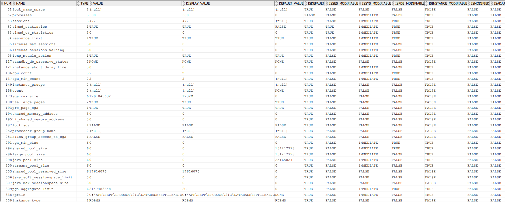
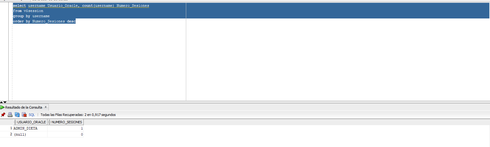
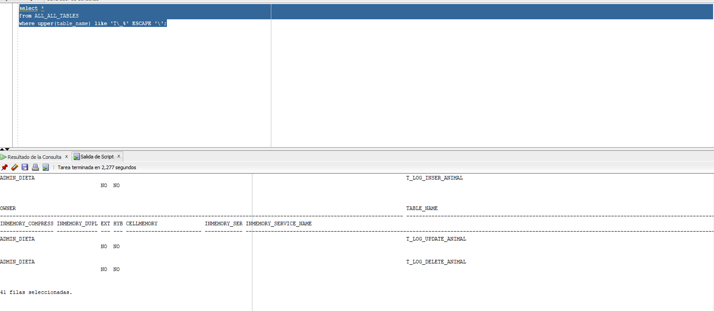
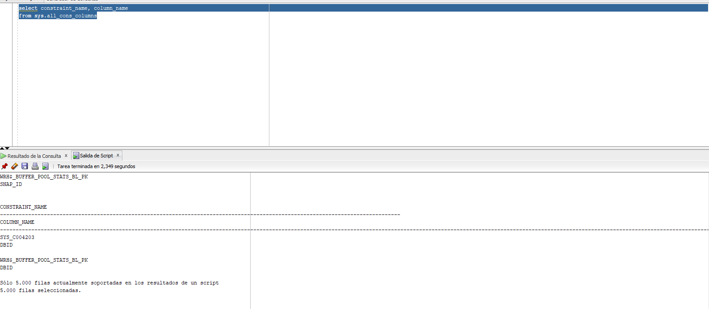
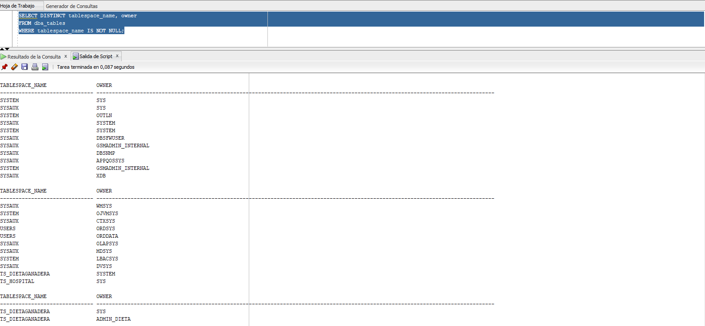
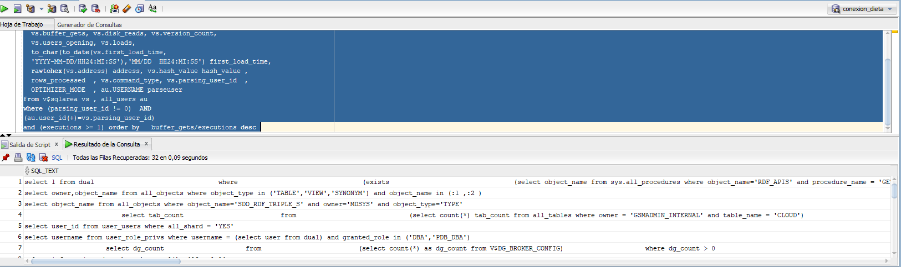
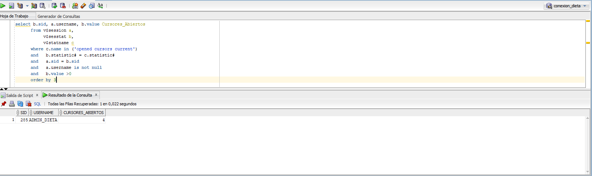
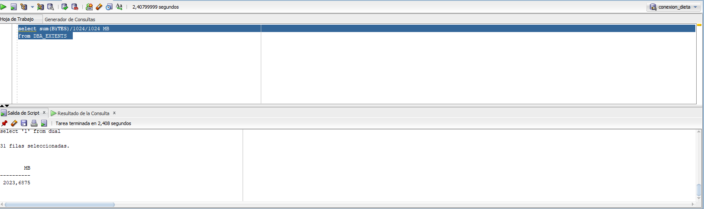
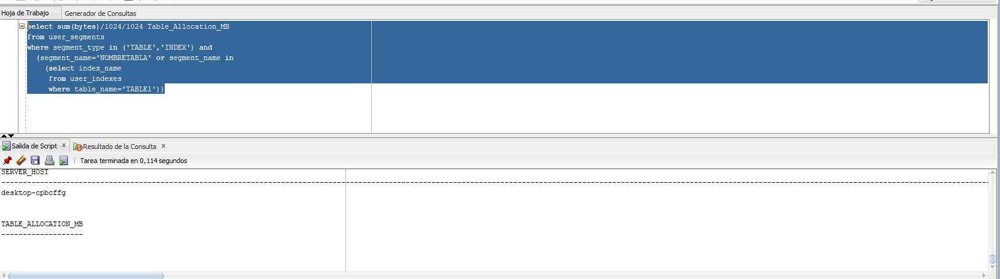
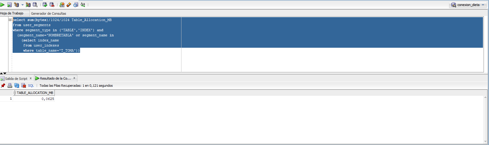

# PR5-1: Monitorización con sentencias sobre vistas del diccionario de datos

<br>
<br>
<br>
<br>
<br>


<br>
<br>
<br>
<br>
<br>

<center>José Ramón Peris</center>
<center>Fecha: 10-10-2023</center>

---

<br>

## Muestra los parámetros generales de Oracle.
```sql
select * from v$system_parameter;
```



## Muestra los usuarios de Oracle conectados y el número de sesiones por usuario.

```sql
select username Usuario_Oracle, count(username) Numero_Sesiones
from v$session
group by username
order by Numero_Sesiones desc;
```



## Muestra los datos de las tablas que empiecen por t_ (nuestras tablas).

```sql
select * 
from ALL_ALL_TABLES 
where upper(table_name) like 'T\_%' ESCAPE '\';
```



## Muestra todas las tablas propiedad del usuario actual.

```sql
select * from user_tables;
```


## Muestra todas las reglas de integridad y columna a la que afectan.

```sql
select constraint_name, column_name 
from sys.all_cons_columns;
```



## Muestra los Tablespaces y propietarios de los mismos.

```sql
SELECT DISTINCT tablespace_name, owner
FROM dba_tables
WHERE tablespace_name IS NOT NULL;
```



## Muestra las últimas consultas SQL ejecutadas en Oracle y usuario que las ejecutó.

```sql
select distinct vs.sql_text, vs.sharable_mem, 
  vs.persistent_mem, vs.runtime_mem,  vs.sorts,
  vs.executions, vs.parse_calls, vs.module,  
  vs.buffer_gets, vs.disk_reads, vs.version_count, 
  vs.users_opening, vs.loads,  
  to_char(to_date(vs.first_load_time,
  'YYYY-MM-DD/HH24:MI:SS'),'MM/DD  HH24:MI:SS') first_load_time,  
  rawtohex(vs.address) address, vs.hash_value hash_value , 
  rows_processed  , vs.command_type, vs.parsing_user_id  , 
  OPTIMIZER_MODE  , au.USERNAME parseuser  
from v$sqlarea vs , all_users au   
where (parsing_user_id != 0)  AND 
(au.user_id(+)=vs.parsing_user_id)  
and (executions >= 1) order by   buffer_gets/executions desc 
```



## Muestra los cursores abiertos por usuario.

```sql
select b.sid, a.username, b.value Cursores_Abiertos
      from v$session a,
           v$sesstat b,
           v$statname c
      where c.name in ('opened cursors current')
      and   b.statistic# = c.statistic#
      and   a.sid = b.sid 
      and   a.username is not null
      and   b.value >0
      order by 3
```




## Muestra el tamaño ocupado por la base de datos.

```sql
select sum(BYTES)/1024/1024 MB 
from DBA_EXTENTS  
```



## Muestra el tamaño de los ficheros de datos de la base de datos.

```sql
select sum(bytes)/1024/1024 MB 
from dba_data_files
```


## Muestra el tamaño ocupado por una tabla concreta incluyendo los índices de la misma.

```sql
select sum(bytes)/1024/1024 Table_Allocation_MB 
from user_segments
where segment_type in ('TABLE','INDEX') and
  (segment_name='NOMBRETABLA' or segment_name in
    (select index_name 
     from user_indexes 
     where table_name='T_TOMA'))
```



- Después


## Obtener la IP del servidor de la base de datos Oracle Database.

```sql
SELECT SYS_CONTEXT('USERENV', 'SERVER_HOST') AS server_host,
       SYS_CONTEXT('USERENV', 'IP_ADDRESS') AS ip_address
FROM DUAL;
```



