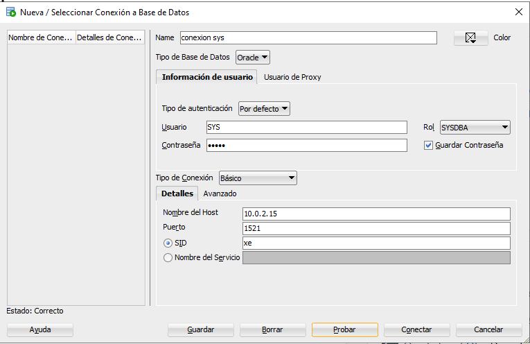

# PR1-1: Instalación de un SGBD Oracle e informes
<br>
<br>
<br>
<br>
<br>


<br>
<br>
<br>
<br>
<br>

<center>José Ramón Peris</center>
<center>Fecha: 10-10-2023</center>

---

<br>

## Creación de tablespaces

## Instalación de la base de datos y sql_developer

- Vamos a la web de **oracle** y después de registrarnos, descargamos e instalamos los dos programas.


- Le volcamos la *contraseña* para **SYS, SYSTEM y PDBADMIN**.


- El ***sql-developer*** es un extraible sin instalación.


- Ahora crearemos una conexión para SYS. Se realiza esta conexión para crear los *usuarios* y las *tablespaces*



## Crea dos tablespace, uno para dieta_ganadera y otro para hospital

- Para crear los dos *Tablespaces* usamos la sintaxis:

```sql
create tablespace ts_dietaganadera
datafile 'C:\app\sepp\product\21c\ts_dietaganadera.dbf'
size 100M
autoextend on next 10 M
maxsize 2G;
```


```sql
create tablespace ts_hospital
datafile 'C:\app\sepp\product\21c\ts_hospital.dbf'
size 100M
autoextend on next 10 M
maxsize 2G;
```


## Creacion de tablas

- Ahora crearemos todas las tablas de la bbdd modificandola para **Oracle**. Usará la siguiente estructura:

### Db_hospital

```sql
CREATE TABLE t_consulta (
  id_consulta VARCHAR2(45) NOT NULL,
  id_doctor NUMBER(3) NOT NULL,
  id_paciente NUMBER(5) NOT NULL,
  fecha_consulta date NOT NULL,
  CONSTRAINT Pk_consulta PRIMARY KEY (id_consulta)
) TABLESPACE ts_hospital;

CREATE INDEX Fk_consulta_doctor ON t_consulta(id_doctor);
CREATE INDEX Fk_consulta_paciente ON t_consulta(id_paciente);


INSERT ALL 
  INTO t_consulta (id_consulta, id_doctor, id_paciente, fecha_consulta) VALUES ('1', 9, 1, TO_DATE('2020-08-30','YYYY-MM-DD'))
  INTO t_consulta (id_consulta, id_doctor, id_paciente, fecha_consulta) VALUES ('10', 1, 1, TO_DATE('2022-09-15','YYYY-MM-DD'))
  INTO t_consulta (id_consulta, id_doctor, id_paciente, fecha_consulta) VALUES ('2', 22, 2, TO_DATE('2021-03-25','YYYY-MM-DD'))
  INTO t_consulta (id_consulta, id_doctor, id_paciente, fecha_consulta) VALUES ('3', 35, 4, TO_DATE('2023-02-23','YYYY-MM-DD'))
  INTO t_consulta (id_consulta, id_doctor, id_paciente, fecha_consulta) VALUES ('4', 9, 7, TO_DATE('2023-01-15','YYYY-MM-DD'))
  INTO t_consulta (id_consulta, id_doctor, id_paciente, fecha_consulta) VALUES ('5', 9, 8, TO_DATE('2022-12-04','YYYY-MM-DD'))
  INTO t_consulta (id_consulta, id_doctor, id_paciente, fecha_consulta) VALUES ('6', 8, 24, TO_DATE('2022-12-03','YYYY-MM-DD'))
  INTO t_consulta (id_consulta, id_doctor, id_paciente, fecha_consulta) VALUES ('7', 1, 25, TO_DATE('2022-11-29','YYYY-MM-DD'))
  INTO t_consulta (id_consulta, id_doctor, id_paciente, fecha_consulta) VALUES ('8', 1, 26, TO_DATE('2022-12-15','YYYY-MM-DD'))
  INTO t_consulta (id_consulta, id_doctor, id_paciente, fecha_consulta) VALUES ('9', 1, 25, TO_DATE('2023-02-10','YYYY-MM-DD'))
SELECT * FROM dual;

---


CREATE TABLE t_cp_poblacion (
  codigo_postal VARCHAR2(5) NOT NULL,
  poblacion VARCHAR2(50) NOT NULL,
  CONSTRAINT Pk_cp_poblacion PRIMARY KEY (codigo_postal,poblacion)  
) TABLESPACE ts_hospital;

INSERT ALL 
  INTO t_cp_poblacion (codigo_postal, poblacion) VALUES ('46001', 'Valencia')
  INTO t_cp_poblacion (codigo_postal, poblacion) VALUES ('46002', 'Valencia')
  INTO t_cp_poblacion (codigo_postal, poblacion) VALUES ('46200', 'Paiporta')
  INTO t_cp_poblacion (codigo_postal, poblacion) VALUES ('46210', 'Picanya')
  INTO t_cp_poblacion (codigo_postal, poblacion) VALUES ('46460', 'Silla')
  INTO t_cp_poblacion (codigo_postal, poblacion) VALUES ('46469', 'Beniparrell')
  INTO t_cp_poblacion (codigo_postal, poblacion) VALUES ('46470', 'Albal')
  INTO t_cp_poblacion (codigo_postal, poblacion) VALUES ('46470', 'Catarroja')
  INTO t_cp_poblacion (codigo_postal, poblacion) VALUES ('46470', 'Massanassa')
  INTO t_cp_poblacion (codigo_postal, poblacion) VALUES ('46900', 'Torrent')
  INTO t_cp_poblacion (codigo_postal, poblacion) VALUES ('46901', 'Torrent')
  INTO t_cp_poblacion (codigo_postal, poblacion) VALUES ('46970', 'Alaquas')
SELECT * FROM dual;

---

CREATE TABLE t_diagnostico (
  id_diagnostico NUMBER(5) NOT NULL,
  descripcion VARCHAR2(200) NOT NULL,
  consulta_id VARCHAR2(45) NOT NULL,
  CONSTRAINT Pk_diagnostico PRIMARY KEY (id_diagnostico)
) TABLESPACE ts_hospital;

CREATE INDEX Fk_diagnostico_consulta ON t_diagnostico(consulta_id);

INSERT ALL 
  INTO t_diagnostico (id_diagnostico, descripcion, consulta_id) VALUES (1, 'Alergia a los ácaros', '1')
  INTO t_diagnostico (id_diagnostico, descripcion, consulta_id) VALUES (2, 'Alergia a la humedad', '2')
  INTO t_diagnostico (id_diagnostico, descripcion, consulta_id) VALUES (3, 'Alergia a los frutos secos', '3')
  INTO t_diagnostico (id_diagnostico, descripcion, consulta_id) VALUES (4, 'Alergia al polen', '4')
  INTO t_diagnostico (id_diagnostico, descripcion, consulta_id) VALUES (5, 'Alergia al pelo de gato', '5')
  INTO t_diagnostico (id_diagnostico, descripcion, consulta_id) VALUES (6, 'Alergia al ciprés', '10')
  INTO t_diagnostico (id_diagnostico, descripcion, consulta_id) VALUES (7, 'Neumonía leve', '6')
  INTO t_diagnostico (id_diagnostico, descripcion, consulta_id) VALUES (8, 'Neumonía grave', '7')
SELECT * FROM dual;

---

CREATE TABLE t_doctor (
  id_doctor NUMBER(3) NOT NULL,
  nombre VARCHAR2(50) NOT NULL,
  apellido1 VARCHAR2(50) NOT NULL,
  apellido2 VARCHAR2(50) DEFAULT NULL,
  genero VARCHAR2(8) NOT NULL,
  especialidad VARCHAR2(150) NOT NULL,
  CONSTRAINT Pk_doctor PRIMARY KEY (id_doctor),
  CONSTRAINT UK_doctor UNIQUE (nombre,apellido1,apellido2)
) TABLESPACE ts_hospital;


INSERT ALL 
  INTO t_doctor (id_doctor, nombre, apellido1, apellido2, genero, especialidad) VALUES (1, 'Amparo', 'Domingo', 'Hernández', 'mujer', 'neumología')
  INTO t_doctor (id_doctor, nombre, apellido1, apellido2, genero, especialidad) VALUES (2, 'Sara', 'Martínez', 'Alberola', 'mujer', 'cardiología')
  INTO t_doctor (id_doctor, nombre, apellido1, apellido2, genero, especialidad) VALUES (3, 'Juan', 'Ibáñez', 'Martí', 'hombre', 'dermatología')
  INTO t_doctor (id_doctor, nombre, apellido1, apellido2, genero, especialidad) VALUES (4, 'Carmen', 'Romeu', 'Rosaleny', 'mujer', 'endocrinología')
  INTO t_doctor (id_doctor, nombre, apellido1, apellido2, genero, especialidad) VALUES (5, 'Sergio', 'Zaragozá', 'Horcajuelo', 'hombre', 'neurología')
  INTO t_doctor (id_doctor, nombre, apellido1, apellido2, genero, especialidad) VALUES (6, 'Ariel', 'del Pozo', 'Ribes', 'hombre', 'medicina interna')
  INTO t_doctor (id_doctor, nombre, apellido1, apellido2, genero, especialidad) VALUES (7, 'Arón', 'Sánchez', 'Palomares', 'hombre', 'geriatría')
  INTO t_doctor (id_doctor, nombre, apellido1, apellido2, genero, especialidad) VALUES (8, 'Carles', 'Escribá', 'Santamans', 'hombre', 'anestesiología')
  INTO t_doctor (id_doctor, nombre, apellido1, apellido2, genero, especialidad) VALUES (9, 'Alexis', 'Llopis', 'Prats', 'hombre', 'alergología')
  INTO t_doctor (id_doctor, nombre, apellido1, apellido2, genero, especialidad) VALUES (10, 'Pedro', 'Montiel', 'Regal', 'hombre', 'reumatología')
  INTO t_doctor (id_doctor, nombre, apellido1, apellido2, genero, especialidad) VALUES (11, 'Leonor', 'Rodrigo', 'Ramón', 'mujer', 'toxicología')
  INTO t_doctor (id_doctor, nombre, apellido1, apellido2, genero, especialidad) VALUES (12, 'Daniel', 'Ortuño', 'Carrasco', 'hombre', 'pediatría')
  INTO t_doctor (id_doctor, nombre, apellido1, apellido2, genero, especialidad) VALUES (13, 'Diego', 'Alcahut', 'Benavent', 'hombre', 'nutriología')
  INTO t_doctor (id_doctor, nombre, apellido1, apellido2, genero, especialidad) VALUES (14, 'Lorena', 'Dies', 'Ivanets', 'mujer', 'medicina familiar')
  INTO t_doctor (id_doctor, nombre, apellido1, apellido2, genero, especialidad) VALUES (15, 'Emilio', 'Ardila', 'Javaloyas', 'hombre', 'cardiología')
  INTO t_doctor (id_doctor, nombre, apellido1, apellido2, genero, especialidad) VALUES (16, 'Erik', 'Pla', 'Fernández', 'hombre', 'dermatología')
  INTO t_doctor (id_doctor, nombre, apellido1, apellido2, genero, especialidad) VALUES (17, 'María', 'Sanchis', 'Pérez', 'mujer', 'endocrinología')
  INTO t_doctor (id_doctor, nombre, apellido1, apellido2, genero, especialidad) VALUES (18, 'Esmeralda', 'Sahuquillo', 'Torrent', 'mujer', 'neurología')
  INTO t_doctor (id_doctor, nombre, apellido1, apellido2, genero, especialidad) VALUES (19, 'Guzmán', 'Girbés', 'Plá', 'hombre', 'medicina forense')
  INTO t_doctor (id_doctor, nombre, apellido1, apellido2, genero, especialidad) VALUES (20, 'Imma', 'Ramírez', 'Cebolla', 'mujer', 'geriatría')
  INTO t_doctor (id_doctor, nombre, apellido1, apellido2, genero, especialidad) VALUES (21, 'Francisco', 'Zaragozá', 'Girbés', 'hombre', 'anestesiología')
  INTO t_doctor (id_doctor, nombre, apellido1, apellido2, genero, especialidad) VALUES (22, 'Joel', 'Murcia', 'Richart', 'hombre', 'alergología')
  INTO t_doctor (id_doctor, nombre, apellido1, apellido2, genero, especialidad) VALUES (23, 'Miguel', 'Pastor', 'Castells', 'hombre', 'reumatología')
  INTO t_doctor (id_doctor, nombre, apellido1, apellido2, genero, especialidad) VALUES (24, 'Eva', 'Boluda', 'Rodríguez', 'mujer', 'toxicología')
  INTO t_doctor (id_doctor, nombre, apellido1, apellido2, genero, especialidad) VALUES (25, 'Dolores', 'Vázquez', 'Cebriá', 'mujer', 'pediatría')
  INTO t_doctor (id_doctor, nombre, apellido1, apellido2, genero, especialidad) VALUES (26, 'Julio', 'Adam', 'Mulet', 'hombre', 'nutriología')
  INTO t_doctor (id_doctor, nombre, apellido1, apellido2, genero, especialidad) VALUES (27, 'Julia', 'Dávila', 'Roig', 'mujer', 'medicina familiar')
  INTO t_doctor (id_doctor, nombre, apellido1, apellido2, genero, especialidad) VALUES (28, 'Peisen', 'Dong', NULL, 'hombre', 'cardiología')
  INTO t_doctor (id_doctor, nombre, apellido1, apellido2, genero, especialidad) VALUES (29, 'Pablo', 'Rivero', 'Puigcerver', 'hombre', 'dermatología')
  INTO t_doctor (id_doctor, nombre, apellido1, apellido2, genero, especialidad) VALUES (30, 'Rubén', 'Doménech', 'Aranda', 'hombre', 'endocrinología')
  INTO t_doctor (id_doctor, nombre, apellido1, apellido2, genero, especialidad) VALUES (31, 'Xavier', 'Yuncal', 'Aliques', 'hombre', 'neurología')
  INTO t_doctor (id_doctor, nombre, apellido1, apellido2, genero, especialidad) VALUES (32, 'Telmo', 'Romero', 'Maíques', 'hombre', 'oncología médica')
  INTO t_doctor (id_doctor, nombre, apellido1, apellido2, genero, especialidad) VALUES (33, 'Víctor', 'Gelida', 'Bover', 'hombre', 'oncología radioterápica')
  INTO t_doctor (id_doctor, nombre, apellido1, apellido2, genero, especialidad) VALUES (34, 'Yann', 'Yuncal', 'Lacuesta', 'hombre', 'oncología radioterápica')
  INTO t_doctor (id_doctor, nombre, apellido1, apellido2, genero, especialidad) VALUES (35, 'Mónica', 'Visent', 'Aranda', 'mujer', 'alergología')
  INTO t_doctor (id_doctor, nombre, apellido1, apellido2, genero, especialidad) VALUES (36, 'Isabel', 'Montejano', 'Doménech', 'mujer', 'reumatología')
  INTO t_doctor (id_doctor, nombre, apellido1, apellido2, genero, especialidad) VALUES (37, 'Leonardo', 'Alcañiz', 'Murcia', 'hombre', 'toxicología')
  INTO t_doctor (id_doctor, nombre, apellido1, apellido2, genero, especialidad) VALUES (38, 'Emilia', 'Abella', 'González', 'mujer', 'pediatría')
  INTO t_doctor (id_doctor, nombre, apellido1, apellido2, genero, especialidad) VALUES (39, 'Bernardo', 'Baeza', 'Calatayud', 'hombre', 'nutriología')
  INTO t_doctor (id_doctor, nombre, apellido1, apellido2, genero, especialidad) VALUES (40, 'Abelardo', 'Martínez', 'Gómez', 'hombre', 'medicina familiar')
SELECT * FROM dual;

---

CREATE TABLE t_medicamento (
  id_medicamento NUMBER(5) NOT NULL,
  nombre VARCHAR2(100) NOT NULL,
  CONSTRAINT Pk_medicamento PRIMARY KEY (id_medicamento)
) TABLESPACE ts_hospital;

INSERT ALL 
  INTO t_medicamento (id_medicamento, nombre) VALUES (1, 'Ebastel Forte Flash')
  INTO t_medicamento (id_medicamento, nombre) VALUES (2, 'Zithromax')
SELECT * FROM dual;

---

CREATE TABLE t_medicamento_sintoma (
  id_sintoma NUMBER(5) NOT NULL,
  id_medicamento NUMBER(5) NOT NULL,
  dosis_diaria NUMBER NOT NULL,
  CONSTRAINT Pk_medicamento_sintoma PRIMARY KEY (id_medicamento,id_sintoma)
) TABLESPACE ts_hospital;

CREATE INDEX Fk_medicsint_medicamento ON t_medicamento_sintoma(id_medicamento);

INSERT ALL 
  INTO T_medicamento_sintoma (id_sintoma, id_medicamento, dosis_diaria) VALUES (1, 1, 1)
  INTO T_medicamento_sintoma (id_sintoma, id_medicamento, dosis_diaria) VALUES (2, 1, 1)
  INTO T_medicamento_sintoma (id_sintoma, id_medicamento, dosis_diaria) VALUES (3, 1, 1)
  INTO T_medicamento_sintoma (id_sintoma, id_medicamento, dosis_diaria) VALUES (4, 1, 1)
  INTO T_medicamento_sintoma (id_sintoma, id_medicamento, dosis_diaria) VALUES (5, 1, 1)
  INTO T_medicamento_sintoma (id_sintoma, id_medicamento, dosis_diaria) VALUES (6, 1, 1)
  INTO T_medicamento_sintoma (id_sintoma, id_medicamento, dosis_diaria) VALUES (7, 2, 3)
  INTO T_medicamento_sintoma (id_sintoma, id_medicamento, dosis_diaria) VALUES (8, 2, 3)
SELECT * FROM dual;

---

CREATE TABLE t_paciente (
  id_paciente NUMBER(5) NOT NULL,
  nombre VARCHAR2(50) NOT NULL,
  apellido1 VARCHAR2(50) NOT NULL,
  apellido2 VARCHAR2(50) DEFAULT NULL,
  genero VARCHAR2(8) NOT NULL,
  f_nacimiento date NOT NULL,
  cod_via NUMBER(5) NOT NULL,
  cod_post VARCHAR2(5) NOT NULL,
  poblacion VARCHAR2(50) NOT NULL,
  telf_contacto VARCHAR2(15) NOT NULL,
  CONSTRAINT Pk_paciente PRIMARY KEY (id_paciente),
  CONSTRAINT UK_paciente UNIQUE (nombre,apellido1,apellido2)
) TABLESPACE ts_hospital;

CREATE INDEX Fk_paciente_via ON t_paciente(cod_via);
CREATE INDEX Fk_paciente_cp_poblacion ON t_paciente(cod_post);

INSERT ALL 
  INTO t_paciente (id_paciente, nombre, apellido1, apellido2, genero, f_nacimiento, cod_via, cod_post, poblacion, telf_contacto) VALUES (1, 'Mónico', 'Naranjo', 'Álvarez', 'mujer', TO_DATE('2000-02-29','YYYY-MM-DD'), 1, '46200', 'Paiporta', '630697643')
  INTO t_paciente (id_paciente, nombre, apellido1, apellido2, genero, f_nacimiento, cod_via, cod_post, poblacion, telf_contacto) VALUES (2, 'Carlos', 'Naranjo', 'Álvarez', 'hombre', TO_DATE('2000-02-29','YYYY-MM-DD'), 1, '46200', 'Paiporta', '670441572')
  INTO t_paciente (id_paciente, nombre, apellido1, apellido2, genero, f_nacimiento, cod_via, cod_post, poblacion, telf_contacto) VALUES (3, 'Alberto', 'Revert', 'Domingo', 'hombre', TO_DATE('2010-08-19','YYYY-MM-DD'), 2, '46200', 'Paiporta', '645267895')
  INTO t_paciente (id_paciente, nombre, apellido1, apellido2, genero, f_nacimiento, cod_via, cod_post, poblacion, telf_contacto) VALUES (4, 'Sara', 'Sánchez', 'Alberola', 'mujer', TO_DATE('1980-02-29','YYYY-MM-DD'), 3, '46200', 'Paiporta', '630697643')
  INTO t_paciente (id_paciente, nombre, apellido1, apellido2, genero, f_nacimiento, cod_via, cod_post, poblacion, telf_contacto) VALUES (5, 'Elvira', 'Mayordomo', 'Casal', 'mujer', TO_DATE('1978-02-28','YYYY-MM-DD'), 4, '46970', 'Alaquas', '630697643')
  INTO t_paciente (id_paciente, nombre, apellido1, apellido2, genero, f_nacimiento, cod_via, cod_post, poblacion, telf_contacto) VALUES (6, 'Manuel', 'Carrasco', 'Turizo', 'hombre', TO_DATE('1984-10-29','YYYY-MM-DD'), 5, '46970', 'Alaquas', '630697643')
  INTO t_paciente (id_paciente, nombre, apellido1, apellido2, genero, f_nacimiento, cod_via, cod_post, poblacion, telf_contacto) VALUES (7, 'Javier', 'Rosaleny', 'Lluesa', 'hombre', TO_DATE('1997-03-25','YYYY-MM-DD'), 6, '46460', 'Silla', '630697643')
  INTO t_paciente (id_paciente, nombre, apellido1, apellido2, genero, f_nacimiento, cod_via, cod_post, poblacion, telf_contacto) VALUES (8, 'Pedro', 'Rosaleny', 'Lluesa', 'hombre', TO_DATE('1997-03-25','YYYY-MM-DD'), 6, '46460', 'Silla', '630697643')
  INTO t_paciente (id_paciente, nombre, apellido1, apellido2, genero, f_nacimiento, cod_via, cod_post, poblacion, telf_contacto) VALUES (9, 'Ernesto', 'Martínez', 'Samper', 'hombre', TO_DATE('1998-09-18','YYYY-MM-DD'), 7, '46210', 'Picanya', '630697643')
  INTO t_paciente (id_paciente, nombre, apellido1, apellido2, genero, f_nacimiento, cod_via, cod_post, poblacion, telf_contacto) VALUES (10, 'Isaac', 'Martínez', 'Samper', 'hombre', TO_DATE('2000-05-23','YYYY-MM-DD'), 7, '46210', 'Picanya', '630697643')
  INTO t_paciente (id_paciente, nombre, apellido1, apellido2, genero, f_nacimiento, cod_via, cod_post, poblacion, telf_contacto) VALUES (11, 'Jose Manuel', 'Seda', 'Parada', 'hombre', TO_DATE('2000-07-12','YYYY-MM-DD'), 8, '46210', 'Picanya', '630697643')
  INTO t_paciente (id_paciente, nombre, apellido1, apellido2, genero, f_nacimiento, cod_via, cod_post, poblacion, telf_contacto) VALUES (12, 'Isabel', 'Espuig', 'Álvarez ', 'mujer', TO_DATE('2007-04-12','YYYY-MM-DD'), 9, '46900', 'Torrent', '673897236')
  INTO t_paciente (id_paciente, nombre, apellido1, apellido2, genero, f_nacimiento, cod_via, cod_post, poblacion, telf_contacto) VALUES (13, 'Irene', 'Espuig', 'Álvarez', 'mujer', TO_DATE('2011-07-21','YYYY-MM-DD'), 9, '46900', 'Torrent', '673897236')
  INTO t_paciente (id_paciente, nombre, apellido1, apellido2, genero, f_nacimiento, cod_via, cod_post, poblacion, telf_contacto) VALUES (14, 'Verónica', 'Espuig', 'Álvarez', 'mujer', TO_DATE('2013-01-10','YYYY-MM-DD'), 9, '46900', 'Torrent', '673897236')
  INTO t_paciente (id_paciente, nombre, apellido1, apellido2, genero, f_nacimiento, cod_via, cod_post, poblacion, telf_contacto) VALUES (15, 'Juan', 'García', 'López', 'hombre', TO_DATE('1990-05-12','YYYY-MM-DD'), 14, '46901', 'Torrent', '962345678')
  INTO t_paciente (id_paciente, nombre, apellido1, apellido2, genero, f_nacimiento, cod_via, cod_post, poblacion, telf_contacto) VALUES (16, 'María', 'Martínez', 'González', 'mujer', TO_DATE('1985-08-22','YYYY-MM-DD'), 14, '46901', 'Torrent', '911234567')
  INTO t_paciente (id_paciente, nombre, apellido1, apellido2, genero, f_nacimiento, cod_via, cod_post, poblacion, telf_contacto) VALUES (17, 'Pedro', 'Hernández', 'Pérez', 'hombre', TO_DATE('1995-11-30','YYYY-MM-DD'), 15, '46900', 'Torrent', '963456789')
  INTO t_paciente (id_paciente, nombre, apellido1, apellido2, genero, f_nacimiento, cod_via, cod_post, poblacion, telf_contacto) VALUES (18, 'Lucía', 'Sánchez', 'Ruiz', 'mujer', TO_DATE('1982-03-18','YYYY-MM-DD'), 16, '46900', 'Torrent', '964567890')
  INTO t_paciente (id_paciente, nombre, apellido1, apellido2, genero, f_nacimiento, cod_via, cod_post, poblacion, telf_contacto) VALUES (19, 'Antonio', 'Gómez', 'Sánchez', 'hombre', TO_DATE('1978-06-02','YYYY-MM-DD'), 17, '46900', 'Torrent', '965678901')
  INTO t_paciente (id_paciente, nombre, apellido1, apellido2, genero, f_nacimiento, cod_via, cod_post, poblacion, telf_contacto) VALUES (20, 'Carmen', 'García', 'Hernández', 'mujer', TO_DATE('1992-09-14','YYYY-MM-DD'), 18, '46469', 'Beniparrell', '966789012')
  INTO t_paciente (id_paciente, nombre, apellido1, apellido2, genero, f_nacimiento, cod_via, cod_post, poblacion, telf_contacto) VALUES (21, 'Javier', 'Martín', 'Moreno', 'hombre', TO_DATE('1980-12-26','YYYY-MM-DD'), 19, '46469', 'Beniparrell', '967890123')
  INTO t_paciente (id_paciente, nombre, apellido1, apellido2, genero, f_nacimiento, cod_via, cod_post, poblacion, telf_contacto) VALUES (22, 'Laura', 'Pérez', 'González', 'mujer', TO_DATE('1998-01-08','YYYY-MM-DD'), 20, '46469', 'Beniparrell', '968901234')
  INTO t_paciente (id_paciente, nombre, apellido1, apellido2, genero, f_nacimiento, cod_via, cod_post, poblacion, telf_contacto) VALUES (23, 'Manuel', 'Rodríguez', 'Hernández', 'hombre', TO_DATE('1975-04-22','YYYY-MM-DD'), 21, '46001', 'Valencia',  '969012345')
  INTO t_paciente (id_paciente, nombre, apellido1, apellido2, genero, f_nacimiento, cod_via, cod_post, poblacion, telf_contacto) VALUES (24, 'Marta', 'González', 'Sánchez', 'mujer', TO_DATE('1988-07-04','YYYY-MM-DD'), 22, '46002', 'Valencia', '960123456')
  INTO t_paciente (id_paciente, nombre, apellido1, apellido2, genero, f_nacimiento, cod_via, cod_post, poblacion, telf_contacto) VALUES (25, 'Diego', 'Sánchez', 'Gómez', 'hombre', TO_DATE('1991-10-16','YYYY-MM-DD'), 23, '46002', 'Valencia',  '961234567')
  INTO t_paciente (id_paciente, nombre, apellido1, apellido2, genero, f_nacimiento, cod_via, cod_post, poblacion, telf_contacto) VALUES (26, 'Sara', 'Hernández', 'Pérez', 'mujer', TO_DATE('1984-01-28','YYYY-MM-DD'), 24, '46001', 'Valencia',  '912345678')
  INTO t_paciente (id_paciente, nombre, apellido1, apellido2, genero, f_nacimiento, cod_via, cod_post, poblacion, telf_contacto) VALUES (27, 'Pablo', 'García', 'Ruiz', 'hombre', TO_DATE('1979-05-11','YYYY-MM-DD'), 25, '46001', 'Valencia',  '963456789')
  INTO t_paciente (id_paciente, nombre, apellido1, apellido2, genero, f_nacimiento, cod_via, cod_post, poblacion, telf_contacto) VALUES (28, 'Elena', 'Martínez', 'Hernández', 'mujer', TO_DATE('1993-08-23','YYYY-MM-DD'), 26, '46002', 'Valencia',  '964567890')
  INTO t_paciente (id_paciente, nombre, apellido1, apellido2, genero, f_nacimiento, cod_via, cod_post, poblacion, telf_contacto) VALUES (29, 'Jorge', 'Pérez', 'González', 'hombre', TO_DATE('1974-09-11','YYYY-MM-DD'), 26, '46002', 'Valencia',  '640986754')
SELECT * FROM dual;

---

CREATE TABLE t_paciente_medicamento_tratamiento (
  id_paciente NUMBER(5) NOT NULL,
  id_medicamento NUMBER(5) NOT NULL,
  dosis_diaria NUMBER NOT NULL,
  CONSTRAINT Pk_paciente_medicamento_tratamiento PRIMARY KEY (id_paciente,id_medicamento)
) TABLESPACE ts_hospital;

CREATE INDEX Fk_pacmedtrat_medicamento ON t_paciente_medicamento_tratamiento(id_medicamento);


INSERT ALL 
  INTO t_paciente_medicamento_tratamiento (id_paciente, id_medicamento, dosis_diaria) VALUES (1, 1, 1)
  INTO t_paciente_medicamento_tratamiento (id_paciente, id_medicamento, dosis_diaria) VALUES (2, 1, 1)
  INTO t_paciente_medicamento_tratamiento (id_paciente, id_medicamento, dosis_diaria) VALUES (4, 1, 1)
  INTO t_paciente_medicamento_tratamiento (id_paciente, id_medicamento, dosis_diaria) VALUES (7, 1, 1)
  INTO t_paciente_medicamento_tratamiento (id_paciente, id_medicamento, dosis_diaria) VALUES (8, 1, 1)
  INTO t_paciente_medicamento_tratamiento (id_paciente, id_medicamento, dosis_diaria) VALUES (10, 1, 1)
  INTO t_paciente_medicamento_tratamiento (id_paciente, id_medicamento, dosis_diaria) VALUES (24, 2, 3)
  INTO t_paciente_medicamento_tratamiento (id_paciente, id_medicamento, dosis_diaria) VALUES (25, 2, 3)
  INTO t_paciente_medicamento_tratamiento (id_paciente, id_medicamento, dosis_diaria) VALUES (26, 2, 3)
SELECT * FROM dual;

---

CREATE TABLE t_SINTOMA (
  id_sintoma NUMBER(5) NOT NULL,
  descripcion VARCHAR2(200) NOT NULL,
  id_diagnostico NUMBER(5) NOT NULL,
  CONSTRAINT Pk_sintoma PRIMARY KEY (id_sintoma)
) TABLESPACE ts_hospital;

CREATE INDEX Fk_sintoma_diagnostico ON T_SINTOMA (id_diagnostico);

INSERT ALL 
  INTO T_SINTOMA  (id_sintoma, descripcion, id_diagnostico) VALUES (1, 'Moqueo', 1)
  INTO T_SINTOMA  (id_sintoma, descripcion, id_diagnostico) VALUES (2, 'Ronchas en la piel', 2)
  INTO T_SINTOMA  (id_sintoma, descripcion, id_diagnostico) VALUES (3, 'Estornudos', 3)
  INTO T_SINTOMA  (id_sintoma, descripcion, id_diagnostico) VALUES (4, 'Picor de ojos', 4)
  INTO T_SINTOMA  (id_sintoma, descripcion, id_diagnostico) VALUES (5, 'Moqueo', 5)
  INTO T_SINTOMA  (id_sintoma, descripcion, id_diagnostico) VALUES (6, 'Rinitis', 6)
  INTO T_SINTOMA  (id_sintoma, descripcion, id_diagnostico) VALUES (7, 'Molestia al respirar', 7)
  INTO T_SINTOMA  (id_sintoma, descripcion, id_diagnostico) VALUES (8, 'Ahogo', 8)
SELECT * FROM dual;

---

CREATE TABLE t_via (
  cod_via NUMBER(5) NOT NULL,
  tipo_via VARCHAR2(30) NOT NULL,
  nom_via VARCHAR2(100) NOT NULL,
  numero NUMBER(4) NOT NULL,
  puerta VARCHAR2(4) NOT NULL,
  escalera VARCHAR2(10) DEFAULT NULL,
  portal VARCHAR2(10) DEFAULT NULL,
  piso VARCHAR2(10) DEFAULT NULL,
  CONSTRAINT Pk_via PRIMARY KEY (cod_via)
) TABLESPACE ts_hospital;


INSERT ALL 
  INTO t_via (cod_via, tipo_via, nom_via, numero, puerta, escalera, portal, piso) VALUES (1, 'Calle', 'Sant Roc', 44, '2', NULL, NULL, NULL)
  INTO t_via (cod_via, tipo_via, nom_via, numero, puerta, escalera, portal, piso) VALUES (2, 'Calle', 'Catarroja', 32, '7', NULL, NULL, NULL) 
  INTO t_via (cod_via, tipo_via, nom_via, numero, puerta, escalera, portal, piso) VALUES (3, 'Avenida', 'Alicante', 102, '10', NULL, NULL, NULL)
  INTO t_via (cod_via, tipo_via, nom_via, numero, puerta, escalera, portal, piso) VALUES (4, 'Avenida', 'del Mediterráneo', 144, '12', NULL, NULL, NULL)
  INTO t_via (cod_via, tipo_via, nom_via, numero, puerta, escalera, portal, piso) VALUES (5, 'Calle', '8 de marzo', 7, '22', NULL, NULL, NULL)
  INTO t_via (cod_via, tipo_via, nom_via, numero, puerta, escalera, portal, piso) VALUES (6, 'Calle', 'Sénia', 38, '31', NULL, NULL, NULL)
  INTO t_via (cod_via, tipo_via, nom_via, numero, puerta, escalera, portal, piso) VALUES (7, 'Rambla', 'de la Independencia', 37, '7', NULL, NULL, NULL)
  INTO t_via (cod_via, tipo_via, nom_via, numero, puerta, escalera, portal, piso) VALUES (8, 'Paseo', 'de Gracia', 22, '9', NULL, NULL, NULL)
  INTO t_via (cod_via, tipo_via, nom_via, numero, puerta, escalera, portal, piso) VALUES (9, 'Ronda', 'Norte', 15, '22', NULL, NULL, NULL)
  INTO t_via (cod_via, tipo_via, nom_via, numero, puerta, escalera, portal, piso) VALUES (10, 'Paseo', 'de la Alameda', 24, '8', NULL, NULL, NULL)
  INTO t_via (cod_via, tipo_via, nom_via, numero, puerta, escalera, portal, piso) VALUES (11, 'Calle', 'del Río Arcos', 8, '2', NULL, NULL, NULL)
  INTO t_via (cod_via, tipo_via, nom_via, numero, puerta, escalera, portal, piso) VALUES (12, 'Calle', 'Andrés Mancebo', 16, '12', NULL, NULL, NULL)
  INTO t_via (cod_via, tipo_via, nom_via, numero, puerta, escalera, portal, piso) VALUES (13, 'Avenida', 'del Pueto', 41, '7', NULL, NULL, NULL)
  INTO t_via (cod_via, tipo_via, nom_via, numero, puerta, escalera, portal, piso) VALUES (14, 'Avenida', 'de la Paz', 22, '7', NULL, NULL, NULL)
  INTO t_via (cod_via, tipo_via, nom_via, numero, puerta, escalera, portal, piso) VALUES (15, 'Calle', 'San Juan', 18, '10', NULL, NULL, NULL)
  INTO t_via (cod_via, tipo_via, nom_via, numero, puerta, escalera, portal, piso) VALUES (16, 'Plaza', 'de España', 16, '1', NULL, NULL, NULL)
  INTO t_via (cod_via, tipo_via, nom_via, numero, puerta, escalera, portal, piso) VALUES (17, 'Calle', 'Alcalá', 9, '20', NULL, NULL, NULL)
  INTO t_via (cod_via, tipo_via, nom_via, numero, puerta, escalera, portal, piso) VALUES (18, 'Paseo', 'del Prado', 2, '8', NULL, NULL, NULL)
  INTO t_via (cod_via, tipo_via, nom_via, numero, puerta, escalera, portal, piso) VALUES (19, 'Calle', 'Gran Vía', 8, '15', NULL, NULL, NULL)
  INTO t_via (cod_via, tipo_via, nom_via, numero, puerta, escalera, portal, piso) VALUES (20, 'Avenida', 'de América', 14, '12', NULL, NULL, NULL)
  INTO t_via (cod_via, tipo_via, nom_via, numero, puerta, escalera, portal, piso) VALUES (21, 'Calle', 'Princesa', 22, '25', NULL, NULL, NULL)
  INTO t_via (cod_via, tipo_via, nom_via, numero, puerta, escalera, portal, piso) VALUES (22, 'Calle', 'Almagro', 7, '30', NULL, NULL, NULL)
  INTO t_via (cod_via, tipo_via, nom_via, numero, puerta, escalera, portal, piso) VALUES (23, 'Calle', 'Velázquez', 10, '35', NULL, NULL, NULL)
  INTO t_via (cod_via, tipo_via, nom_via, numero, puerta, escalera, portal, piso) VALUES (24, 'Avenida', 'de los Reyes Católicos', 13, '40', NULL, NULL, NULL)
  INTO t_via (cod_via, tipo_via, nom_via, numero, puerta, escalera, portal, piso) VALUES (25, 'Calle', 'Fuencarral', 1, '45', NULL, NULL, NULL)
  INTO t_via (cod_via, tipo_via, nom_via, numero, puerta, escalera, portal, piso) VALUES (26, 'Calle', 'Mayor', 24, '50', NULL, NULL, NULL)
SELECT * FROM dual;

-- ALTER TABLE FK--

ALTER TABLE t_consulta
  ADD CONSTRAINT Fk_consulta_doctor FOREIGN KEY (id_doctor) REFERENCES t_doctor (id_doctor);
ALTER TABLE t_consulta
  ADD CONSTRAINT Fk_consulta_paciente FOREIGN KEY (id_paciente) REFERENCES t_paciente (id_paciente);
ALTER TABLE t_diagnostico
  ADD CONSTRAINT Fk_diagnostico_consulta FOREIGN KEY (consulta_id) REFERENCES t_consulta (id_consulta);
ALTER TABLE t_medicamento_sintoma
  ADD CONSTRAINT Fk_medicsint_medicamento FOREIGN KEY (id_medicamento)REFERENCES t_medicamento (id_medicamento);
ALTER TABLE t_medicamento_sintoma
  ADD CONSTRAINT Fk_medicsint_sintoma FOREIGN KEY (id_sintoma) REFERENCES t_sintoma (id_sintoma);
ALTER TABLE t_paciente
  ADD CONSTRAINT Fk_paciente_cp_poblacion FOREIGN KEY (cod_post,poblacion) REFERENCES T_CP_POBLACION (codigo_postal,poblacion);
ALTER TABLE t_paciente
  ADD CONSTRAINT Fk_paciente_via FOREIGN KEY (cod_via) REFERENCES t_via (cod_via);
ALTER TABLE t_paciente_medicamento_tratamiento
  ADD CONSTRAINT Fk_pacmedtrat_medicamento FOREIGN KEY (id_medicamento) REFERENCES t_medicamento (id_medicamento);
ALTER TABLE t_paciente_medicamento_tratamiento
  ADD CONSTRAINT Fk_pacmedtrat_paciente FOREIGN KEY (id_paciente) REFERENCES t_paciente (id_paciente);
ALTER TABLE T_SINTOMA 
  ADD CONSTRAINT Fk_sintoma_diagnostico FOREIGN KEY (id_diagnostico) REFERENCES t_diagnostico (id_diagnostico);
```

### Dieta Ganadera

```sql
CREATE TABLE t_alimento(
  nombre_alimento VARCHAR2(20) NOT NULL,
  tipo_alimento VARCHAR2(20) NOT NULL,
  coste NUMBER(6,2) NOT NULL,
  od_alimento VARCHAR2(40) DEFAULT NULL,
  calorias NUMBER(6,2) DEFAULT NULL,
  CONSTRAINT pk PRIMARY KEY (nombre_alimento)
) TABLESPACE ts_dietaganadera;


INSERT ALL
  INTO t_alimento (nombre_alimento, tipo_alimento, coste, od_alimento, calorias) VALUES('alfalfa', 'alfalfa deshidratada', 0.15, 'normativa de calidad', 500.00)
  INTO t_alimento (nombre_alimento, tipo_alimento, coste, od_alimento, calorias) VALUES('algodon', 'semillas de algodon', 0.15, 'alto contenido en fibra', 500.00)
  INTO t_alimento (nombre_alimento, tipo_alimento, coste, od_alimento, calorias) VALUES('cebada', 'grano', 0.40, 'grano triturado', 100.00)
  INTO t_alimento (nombre_alimento, tipo_alimento, coste, od_alimento, calorias) VALUES('maiz', 'grano', 0.15, 'grano machacado', 500.00)
  INTO t_alimento (nombre_alimento, tipo_alimento, coste, od_alimento, calorias) VALUES('pienso', 'pienso', 0.15, 'mezcla de granos', 500.00)
  INTO t_alimento (nombre_alimento, tipo_alimento, coste, od_alimento, calorias) VALUES('soja', 'grano', 0.50, 'grano entero', 250.00)
  INTO t_alimento (nombre_alimento, tipo_alimento, coste, od_alimento, calorias) VALUES('trigo', 'grano', 0.30, 'grano selecto', 300.00)
SELECT * FROM dual;

---
CREATE TABLE t_alimento_dieta_toma(
  cod_dieta INT NOT NULL,
  nombre_alimento VARCHAR2(20) NOT NULL,
  cod_toma INT NOT NULL,
  cantidad_toma NUMBER DEFAULT NULL,
  CONSTRAINT pk_t_alimento_dieta_toma PRIMARY KEY (cod_dieta, nombre_alimento, cod_toma)
) TABLESPACE ts_dietaganadera;

INSERT ALL
  INTO t_alimento_dieta_toma (cod_dieta, nombre_alimento, cod_toma, cantidad_toma) VALUES(1, 'cebada', 1, 200)
  INTO t_alimento_dieta_toma (cod_dieta, nombre_alimento, cod_toma, cantidad_toma) VALUES(1, 'cebada', 3, 100)
  INTO t_alimento_dieta_toma (cod_dieta, nombre_alimento, cod_toma, cantidad_toma) VALUES(1, 'cebada', 5, 150)
  INTO t_alimento_dieta_toma (cod_dieta, nombre_alimento, cod_toma, cantidad_toma) VALUES(1, 'soja', 1, 200)
  INTO t_alimento_dieta_toma (cod_dieta, nombre_alimento, cod_toma, cantidad_toma) VALUES(1, 'soja', 2, 100)
  INTO t_alimento_dieta_toma (cod_dieta, nombre_alimento, cod_toma, cantidad_toma) VALUES(1, 'soja', 4, 150)
  INTO t_alimento_dieta_toma (cod_dieta, nombre_alimento, cod_toma, cantidad_toma) VALUES(2, 'cebada', 1, 200)
  INTO t_alimento_dieta_toma (cod_dieta, nombre_alimento, cod_toma, cantidad_toma) VALUES(2, 'cebada', 3, 100)
  INTO t_alimento_dieta_toma (cod_dieta, nombre_alimento, cod_toma, cantidad_toma) VALUES(2, 'cebada', 5, 150)
  INTO t_alimento_dieta_toma (cod_dieta, nombre_alimento, cod_toma, cantidad_toma) VALUES(2, 'soja', 1, 200)
  INTO t_alimento_dieta_toma (cod_dieta, nombre_alimento, cod_toma, cantidad_toma) VALUES(2, 'soja', 3, 100)
  INTO t_alimento_dieta_toma (cod_dieta, nombre_alimento, cod_toma, cantidad_toma) VALUES(2, 'soja', 5, 150)
SELECT * FROM dual;

---
CREATE TABLE t_animal(
  cod_animal INT NOT NULL,
  tipo_animal VARCHAR2(20) NOT NULL,
  peso NUMBER NOT NULL,
  f_nacimiento DATE NOT NULL,
  utilidad_animal VARCHAR2(20) DEFAULT NULL,
  produccion_animal VARCHAR2(20) DEFAULT NULL,
  od_animal VARCHAR2(40) DEFAULT NULL,
  CONSTRAINT pk_animal PRIMARY KEY (cod_animal)
) TABLESPACE ts_dietaganadera;

INSERT ALL
  INTO t_animal (cod_animal, tipo_animal, peso, f_nacimiento, utilidad_animal, produccion_animal, od_animal) VALUES(1, 'bovino', 900, TO_DATE('2012-03-02','YYYY-MM-DD'), 'carnica', 'carniceria', 'carne para carniceria')
  INTO t_animal (cod_animal, tipo_animal, peso, f_nacimiento, utilidad_animal, produccion_animal, od_animal) VALUES(2, 'bovino', 800, TO_DATE('2019-11-05','YYYY-MM-DD'), 'reproduccion', 'semental', 'toro reproductor')
  INTO t_animal (cod_animal, tipo_animal, peso, f_nacimiento, utilidad_animal, produccion_animal, od_animal) VALUES(3, 'bovino', 700, TO_DATE('2008-10-08','YYYY-MM-DD'), 'lactea', 'leche', 'leche entera')
  INTO t_animal (cod_animal, tipo_animal, peso, f_nacimiento, utilidad_animal, produccion_animal, od_animal) VALUES(5, 'bovino', 800, TO_DATE('2017-05-30','YYYY-MM-DD'), 'reproduccion', 'embarazo', 'vaca reproductora')
  INTO t_animal (cod_animal, tipo_animal, peso, f_nacimiento, utilidad_animal, produccion_animal, od_animal) VALUES(6, 'bovino', 800, TO_DATE('2012-09-21','YYYY-MM-DD'), 'lactea', 'queso', 'cabra para queso')
  INTO t_animal (cod_animal, tipo_animal, peso, f_nacimiento, utilidad_animal, produccion_animal, od_animal) VALUES(7, 'equido', 1000, TO_DATE('2015-02-11','YYYY-MM-DD'), 'carnica', 'carniceria', 'caballo para carne')
SELECT * FROM dual;
---
CREATE TABLE t_animal_nutriente (
  cod_animal INT NOT NULL,
  nombre_nutriente VARCHAR2(30) NOT NULL,
  cantidad_necesaria NUMBER NOT NULL,
  CONSTRAINT pk_animal_nutriente PRIMARY KEY (cod_animal, nombre_nutriente)
) TABLESPACE ts_dietaganadera;

INSERT ALL
  INTO t_animal_nutriente (cod_animal, nombre_nutriente, cantidad_necesaria) VALUES (1, 'fibra', 500)
  INTO t_animal_nutriente (cod_animal, nombre_nutriente, cantidad_necesaria) VALUES (1, 'hierro', 300)
  INTO t_animal_nutriente (cod_animal, nombre_nutriente, cantidad_necesaria) VALUES (1, 'potasio', 250)
  INTO t_animal_nutriente (cod_animal, nombre_nutriente, cantidad_necesaria) VALUES (1, 'proteina', 200)
  INTO t_animal_nutriente (cod_animal, nombre_nutriente, cantidad_necesaria) VALUES (1, 'zinc', 5)
  INTO t_animal_nutriente (cod_animal, nombre_nutriente, cantidad_necesaria) VALUES (2, 'fibra', 500)
  INTO t_animal_nutriente (cod_animal, nombre_nutriente, cantidad_necesaria) VALUES (2, 'hierro', 300)
  INTO t_animal_nutriente (cod_animal, nombre_nutriente, cantidad_necesaria) VALUES (2, 'potasio', 250)
  INTO t_animal_nutriente (cod_animal, nombre_nutriente, cantidad_necesaria) VALUES (2, 'proteina', 200)
  INTO t_animal_nutriente (cod_animal, nombre_nutriente, cantidad_necesaria) VALUES (2, 'vitamina B1', 20)
  INTO t_animal_nutriente (cod_animal, nombre_nutriente, cantidad_necesaria) VALUES (2, 'vitamina B5', 15)
  INTO t_animal_nutriente (cod_animal, nombre_nutriente, cantidad_necesaria) VALUES (2, 'vitamina B9', 25)
  INTO t_animal_nutriente (cod_animal, nombre_nutriente, cantidad_necesaria) VALUES (2, 'zinc', 5)
  INTO t_animal_nutriente (cod_animal, nombre_nutriente, cantidad_necesaria) VALUES (3, 'fibra', 500)
  INTO t_animal_nutriente (cod_animal, nombre_nutriente, cantidad_necesaria) VALUES (3, 'hierro', 300)
  INTO t_animal_nutriente (cod_animal, nombre_nutriente, cantidad_necesaria) VALUES (3, 'potasio', 250)
  INTO t_animal_nutriente (cod_animal, nombre_nutriente, cantidad_necesaria) VALUES (3, 'proteina', 200)
  INTO t_animal_nutriente (cod_animal, nombre_nutriente, cantidad_necesaria) VALUES (3, 'vitamina B1', 20)
  INTO t_animal_nutriente (cod_animal, nombre_nutriente, cantidad_necesaria) VALUES (3, 'vitamina B5', 15)
  INTO t_animal_nutriente (cod_animal, nombre_nutriente, cantidad_necesaria) VALUES (3, 'vitamina B7', 25)
  INTO t_animal_nutriente (cod_animal, nombre_nutriente, cantidad_necesaria) VALUES (3, 'vitamina B9', 25)
  INTO t_animal_nutriente (cod_animal, nombre_nutriente, cantidad_necesaria) VALUES (5, 'calcio', 50)
  INTO t_animal_nutriente (cod_animal, nombre_nutriente, cantidad_necesaria) VALUES (5, 'fibra', 500)
  INTO t_animal_nutriente (cod_animal, nombre_nutriente, cantidad_necesaria) VALUES (5, 'hierro', 300)
  INTO t_animal_nutriente (cod_animal, nombre_nutriente, cantidad_necesaria) VALUES (5, 'proteina', 200)
  INTO t_animal_nutriente (cod_animal, nombre_nutriente, cantidad_necesaria) VALUES (5, 'vitamina B1', 20)
  INTO t_animal_nutriente (cod_animal, nombre_nutriente, cantidad_necesaria) VALUES (5, 'vitamina B5', 50)
  INTO t_animal_nutriente (cod_animal, nombre_nutriente, cantidad_necesaria) VALUES (5, 'vitamina B7', 250)
  INTO t_animal_nutriente (cod_animal, nombre_nutriente, cantidad_necesaria) VALUES (5, 'vitamina B9', 30)
  INTO t_animal_nutriente (cod_animal, nombre_nutriente, cantidad_necesaria) VALUES (6, 'calcio', 50)
  INTO t_animal_nutriente (cod_animal, nombre_nutriente, cantidad_necesaria) VALUES (6, 'fibra', 500)
  INTO t_animal_nutriente (cod_animal, nombre_nutriente, cantidad_necesaria) VALUES (6, 'hierro', 300)
  INTO t_animal_nutriente (cod_animal, nombre_nutriente, cantidad_necesaria) VALUES (6, 'potasio', 30)
  INTO t_animal_nutriente (cod_animal, nombre_nutriente, cantidad_necesaria) VALUES (6, 'proteina', 200)
  INTO t_animal_nutriente (cod_animal, nombre_nutriente, cantidad_necesaria) VALUES (6, 'vitamina B1', 20)
  INTO t_animal_nutriente (cod_animal, nombre_nutriente, cantidad_necesaria) VALUES (6, 'vitamina B5', 50)
  INTO t_animal_nutriente (cod_animal, nombre_nutriente, cantidad_necesaria) VALUES (6, 'vitamina B7', 250)
SELECT * FROM dual;


---
CREATE TABLE t_dieta (
  cod_dieta INT NOT NULL,
  finalidad VARCHAR2(20) NOT NULL,
  od_dieta VARCHAR2(40) DEFAULT NULL,
  CONSTRAINT pk_dieta PRIMARY KEY (cod_dieta)
) TABLESPACE ts_dietaganadera;

INSERT ALL
  INTO t_dieta (cod_dieta, finalidad, od_dieta) VALUES (1, 'engorde', 'cereales para engorde')
  INTO t_dieta (cod_dieta, finalidad, od_dieta) VALUES (2, 'crecimiento', 'hormonas')
  INTO t_dieta (cod_dieta, finalidad, od_dieta) VALUES (3, 'adelgazamiento', 'hierba')
  INTO t_dieta (cod_dieta, finalidad, od_dieta) VALUES (4, 'mantenimiento', 'hierba con cereales')
SELECT * FROM dual;
---
CREATE TABLE t_dieta_animal_fechainicio (
  cod_animal INT NOT NULL,
  fecha_inicio DATE NOT NULL,
  cod_dieta INT NOT NULL,
  od_resultado VARCHAR2(40) DEFAULT NULL,
  CONSTRAINT pk_t_dieta_animal_fechainicio PRIMARY KEY (cod_animal, fecha_inicio)
) TABLESPACE ts_dietaganadera;

INSERT ALL
  INTO t_dieta_animal_fechainicio (cod_animal, fecha_inicio, cod_dieta, od_resultado) VALUES (1, TO_DATE('2021-10-01', 'YYYY-MM-DD'), 1, NULL)
  INTO t_dieta_animal_fechainicio (cod_animal, fecha_inicio, cod_dieta, od_resultado) VALUES (2, TO_DATE('2021-01-09', 'YYYY-MM-DD'), 2, NULL)
  INTO t_dieta_animal_fechainicio (cod_animal, fecha_inicio, cod_dieta, od_resultado) VALUES (3, TO_DATE('2020-02-20', 'YYYY-MM-DD'), 2, NULL)
  INTO t_dieta_animal_fechainicio (cod_animal, fecha_inicio, cod_dieta, od_resultado) VALUES (3, TO_DATE('2020-08-12', 'YYYY-MM-DD'), 4, NULL)
  INTO t_dieta_animal_fechainicio (cod_animal, fecha_inicio, cod_dieta, od_resultado) VALUES (5, TO_DATE('2019-07-05', 'YYYY-MM-DD'), 1, NULL)
  INTO t_dieta_animal_fechainicio (cod_animal, fecha_inicio, cod_dieta, od_resultado) VALUES (6, TO_DATE('2020-05-01', 'YYYY-MM-DD'), 4, NULL)
SELECT * FROM dual;
---

CREATE TABLE t_nutriente (
  nombre_nutriente VARCHAR2(30) NOT NULL,
  magnitud_nutriente VARCHAR2(20) NOT NULL,
  estado VARCHAR2(20) DEFAULT NULL,
  od_nutriente VARCHAR2(40) DEFAULT NULL,
  CONSTRAINT pk_nutriente PRIMARY KEY (nombre_nutriente)
) TABLESPACE ts_dietaganadera;

INSERT ALL
 INTO t_nutriente (nombre_nutriente, magnitud_nutriente, estado, od_nutriente) VALUES('calcio', '5', 'desactivo', 'suplemento')
 INTO t_nutriente (nombre_nutriente, magnitud_nutriente, estado, od_nutriente) VALUES('fibra', '15', 'activo', 'aporte del grano')
 INTO t_nutriente (nombre_nutriente, magnitud_nutriente, estado, od_nutriente) VALUES('fosforo', '3', 'desactivo', 'suplemento')
 INTO t_nutriente (nombre_nutriente, magnitud_nutriente, estado, od_nutriente) VALUES('hierro', '20', 'activo', 'aportación de la soja')
 INTO t_nutriente (nombre_nutriente, magnitud_nutriente, estado, od_nutriente) VALUES('potasio', '5', 'activo', 'aportación de la soja')
 INTO t_nutriente (nombre_nutriente, magnitud_nutriente, estado, od_nutriente) VALUES('proteina', '30', 'activo', 'origen vegetal')
 INTO t_nutriente (nombre_nutriente, magnitud_nutriente, estado, od_nutriente) VALUES('vitamina B1', '1', 'activo', 'aporte del grano')
 INTO t_nutriente (nombre_nutriente, magnitud_nutriente, estado, od_nutriente) VALUES('vitamina B5', '0.3', 'activo', 'aporte del grano')
 INTO t_nutriente (nombre_nutriente, magnitud_nutriente, estado, od_nutriente) VALUES('vitamina B7', '0.1', 'activo', 'aporte del grano')
 INTO t_nutriente (nombre_nutriente, magnitud_nutriente, estado, od_nutriente) VALUES('vitamina B9', '0.2', 'activo', 'aporte del grano')
 INTO t_nutriente (nombre_nutriente, magnitud_nutriente, estado, od_nutriente) VALUES('vitamina E', '2', 'activo', 'aporte del grano')
 INTO t_nutriente (nombre_nutriente, magnitud_nutriente, estado, od_nutriente) VALUES('zinc', '3', 'activo', 'aportación de la soja')
SELECT * FROM dual;

---

CREATE TABLE t_nutriente_alimento (
  nombre_nutriente VARCHAR2(30) NOT NULL,
  nombre_alimento VARCHAR2(20) NOT NULL,
  cantidad_contenida NUMBER NOT NULL,
  CONSTRAINT pk_t_nutriente_alimento PRIMARY KEY (nombre_nutriente, nombre_alimento)
) TABLESPACE ts_dietaganadera;

INSERT ALL
 INTO t_nutriente_alimento (nombre_nutriente, nombre_alimento, cantidad_contenida) VALUES('fosforo', 'pienso', 30)
 INTO t_nutriente_alimento (nombre_nutriente, nombre_alimento, cantidad_contenida) VALUES('potasio', 'alfalfa', 300)
 INTO t_nutriente_alimento (nombre_nutriente, nombre_alimento, cantidad_contenida) VALUES('potasio', 'pienso', 30)
 INTO t_nutriente_alimento (nombre_nutriente, nombre_alimento, cantidad_contenida) VALUES('vitamina B1', 'maiz', 50)
 INTO t_nutriente_alimento (nombre_nutriente, nombre_alimento, cantidad_contenida) VALUES('vitamina B5', 'trigo', 150)
SELECT * FROM dual;

---

CREATE TABLE t_toma (
  cod_toma INT NOT NULL,
  nombre_toma VARCHAR2(30) NOT NULL,
  hora_inicio INT DEFAULT NULL,
  hora_fin INT DEFAULT NULL,
  od_toma VARCHAR2(40),
  CONSTRAINT pk_toma PRIMARY KEY (cod_toma)
) TABLESPACE ts_dietaganadera;

INSERT ALL
 INTO t_toma (cod_toma, nombre_toma, hora_inicio, hora_fin, od_toma) VALUES(1, 'matutina', 7, 8, NULL)
 INTO t_toma (cod_toma, nombre_toma, hora_inicio, hora_fin, od_toma) VALUES(2, 'mañana', 11, 12, NULL)
 INTO t_toma (cod_toma, nombre_toma, hora_inicio, hora_fin, od_toma) VALUES(3, 'mediodia', 13, 14, NULL)
 INTO t_toma (cod_toma, nombre_toma, hora_inicio, hora_fin, od_toma) VALUES(4, 'merienda', 17, 18, NULL)
 INTO t_toma (cod_toma, nombre_toma, hora_inicio, hora_fin, od_toma) VALUES(5, 'cena', 20, 21, NULL)
SELECT * FROM dual;


-- ALTER TABLE FK

ALTER TABLE t_alimento_dieta_toma
  ADD CONSTRAINT alimento_dieta_toma_ibfk_1 FOREIGN KEY (cod_dieta) REFERENCES t_dieta (cod_dieta);
ALTER TABLE t_alimento_dieta_toma
  ADD CONSTRAINT alimento_dieta_toma_ibfk_2 FOREIGN KEY (nombre_alimento) REFERENCES t_alimento (nombre_alimento);

ALTER TABLE t_animal_nutriente
  ADD CONSTRAINT Fk_animnutr_animal FOREIGN KEY (cod_animal) REFERENCES t_animal (cod_animal);
ALTER TABLE t_animal_nutriente  
  ADD CONSTRAINT Fk_animnutr_nutriente FOREIGN KEY (nombre_nutriente) REFERENCES t_nutriente (nombre_nutriente);


ALTER TABLE t_dieta_animal_fechainicio
  ADD CONSTRAINT Fk_dietaanimalfechainicio_animal FOREIGN KEY (cod_animal) REFERENCES t_animal (cod_animal);
ALTER TABLE t_dieta_animal_fechainicio  
  ADD CONSTRAINT Fk_dietaanimalfechainicio_dieta FOREIGN KEY (cod_dieta) REFERENCES t_dieta (cod_dieta);

ALTER TABLE t_nutriente_alimento
  ADD CONSTRAINT Fk_nutrientealimento_alimento FOREIGN KEY (nombre_alimento) REFERENCES t_alimento (nombre_alimento);
ALTER TABLE t_nutriente_alimento
  ADD CONSTRAINT Fk_nutrientealimento_nutriente FOREIGN KEY (nombre_nutriente) REFERENCES t_nutriente (nombre_nutriente);

```

- SYS como usuario que ha insertado las tablas ve las siguientes tablas:


## Creación de usuarios y roles

- Ahora crearemos los  usuarios **admin_dieta** y **admin_hospital** con los roles *r_dieta* y *r_hospital* que permitirá tener acceso a las tablas creadas por **SYS**.

- Entramos en **SQLPLUS**

***¡Muy importante!***
**alter session set “_ORACLE_SCRIPT”=true;**

Para crear el rol usamos la siguiente sintaxis

```sql
CREATE ROLE r_dieta;
CREATE ROLE r_hospital;

--GRANT PARA DIETA GANADERA

GRANT SELECT, INSERT, UPDATE, DELETE ON SYS.T_TOMA TO r_dieta;
GRANT SELECT, INSERT, UPDATE, DELETE ON SYS.T_ALIMENTO TO r_dieta;
GRANT SELECT, INSERT, UPDATE, DELETE ON SYS.T_ALIMENTO_DIETA_TOMA TO r_dieta;
GRANT SELECT, INSERT, UPDATE, DELETE ON SYS.T_ANIMAL TO r_dieta;
GRANT SELECT, INSERT, UPDATE, DELETE ON SYS.T_ANIMAL_NUTRIENTE TO r_dieta;
GRANT SELECT, INSERT, UPDATE, DELETE ON SYS.T_DIETA TO r_dieta;
GRANT SELECT, INSERT, UPDATE, DELETE ON SYS.T_DIETA_ANIMAL_FECHAINICIO TO r_dieta;
GRANT SELECT, INSERT, UPDATE, DELETE ON SYS.T_NUTRIENTE TO r_dieta;
GRANT SELECT, INSERT, UPDATE, DELETE ON SYS.T_NUTRIENTE_ALIMENTO TO r_dieta;

--GRANT PARA HOSPITAL

GRANT SELECT, INSERT, UPDATE, DELETE ON SYS.T_CONSULTA TO r_hospital;
GRANT SELECT, INSERT, UPDATE, DELETE ON SYS.T_CP_POBLACION TO r_hospital;
GRANT SELECT, INSERT, UPDATE, DELETE ON SYS.T_DIAGNOSTICO TO r_hospital;
GRANT SELECT, INSERT, UPDATE, DELETE ON SYS.T_DOCTOR TO r_hospital;
GRANT SELECT, INSERT, UPDATE, DELETE ON SYS.T_MEDICAMENTO TO r_hospital;
GRANT SELECT, INSERT, UPDATE, DELETE ON SYS.T_MEDICAMENTO_SINTOMA TO r_hospital;
GRANT SELECT, INSERT, UPDATE, DELETE ON SYS.T_PACIENTE TO r_hospital;
GRANT SELECT, INSERT, UPDATE, DELETE ON SYS.T_PACIENTE_MEDICAMENTO_TRATAMIENTO TO r_hospital;
GRANT SELECT, INSERT, UPDATE, DELETE ON SYS.T_SINTOMA TO r_hospital;

--CREACION DE USUARIO

CREATE USER admin_dieta IDENTIFIED BY "12345" DEFAULT TABLESPACE ts_dietaganadera;
ALTER USER admin_dieta
QUOTA 20M ON ts_dietaganadera;
GRANT ROLE r_dieta TO admin_dieta;
GRANT CONNECT, CREATE SESSION TO admin_dieta;

CREATE USER admin_hospital IDENTIFIED BY "12345" DEFAULT TABLESPACE ts_hospital;
ALTER USER admin_hospital
QUOTA 20M ON ts_hospital;
GRANT ROLE r_hospital TO admin_hospital;
GRANT CONNECT, CREATE SESSION TO admin_hospital;
```

-Demostramos que funciona


## Informes generados automaticamente por ORACLE

- Si en **SQLDEVELOPER** nos ubicamos en ver < informes nos mostrará en los cuadros de nuestra izquierda los informes generados.


- Allí nos encontramos con todo lo relacionado al diccionario de  datos, todas las tablas y sus pertenencias, idioma PLSQL, usuarios y seguridad, relaciones y muchas más cosas que aún no llegamos a entender.

## Comando spool 

- El comando **SPOOL** es una especie de *"keylogger"* que nos guarda todas las acciones que realizemos en un archivo de texto plano en la ubicación que nosotros le indiquemos. Esto es muy útil con el fin de que las pruebas que realizemos tengamos un historial o para realizar un seguimiento de las consultas o acciones que realizen las personas que trabajen con la base de datos.

Ejemplo:

```sql
SPOOL mi_archivo_de_salida.txt
SELECT * FROM sys.t_doctor;
SPOOL OFF
```

