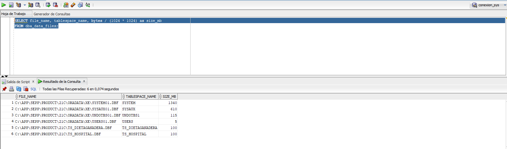
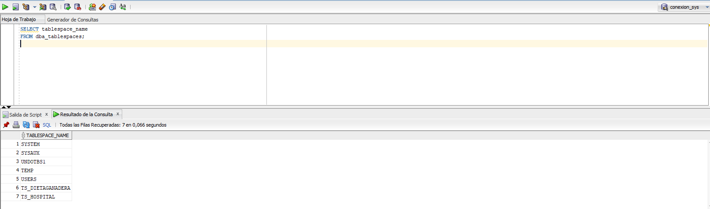
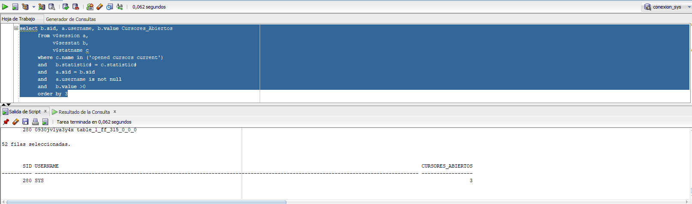
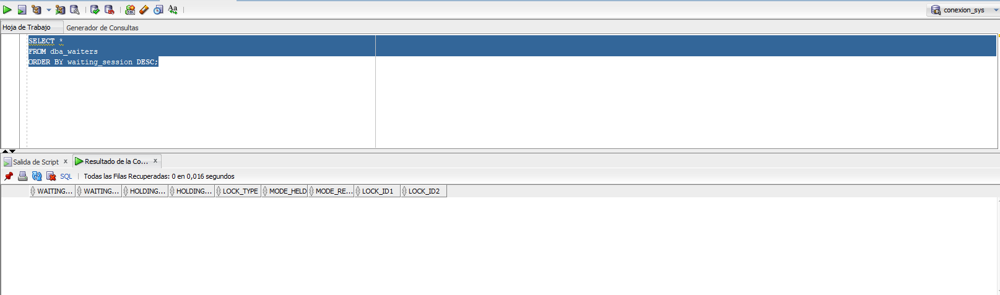
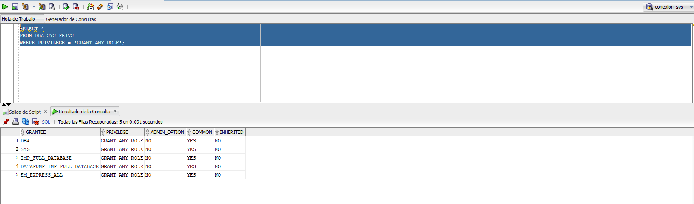
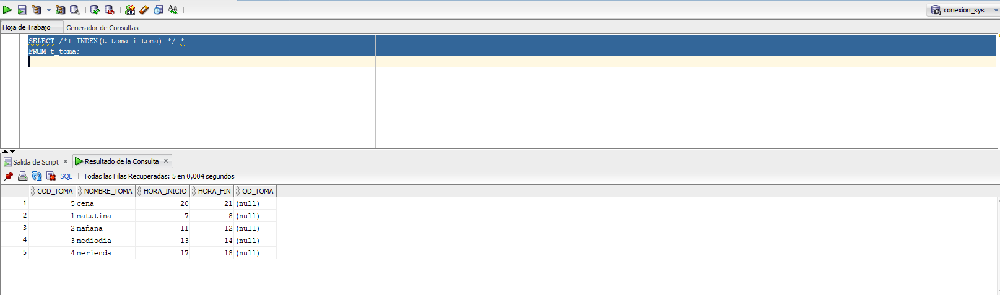
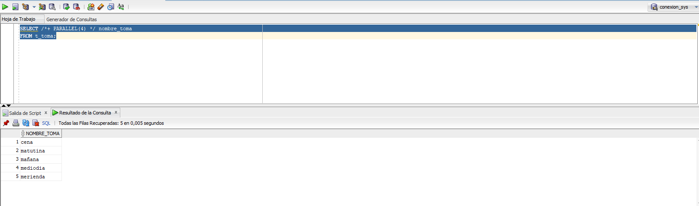

# PR5-1: Monitorización con sentencias sobre vistas del diccionario de datos

<br>
<br>
<br>
<br>
<br>


<br>
<br>
<br>
<br>
<br>

<center>José Ramón Peris</center>
<center>Fecha: 10-10-2023</center>

---

## 1. ¿Cuál es la ruta de los archivos de almacenamiento y cuál es su tamaño?

```sql
SELECT file_name, tablespace_name, bytes / (1024 * 1024) as size_mb
FROM dba_data_files;
```



## 2. ¿Cuáles son los Tablespaces existentes?

```sql
SELECT tablespace_name
FROM dba_tablespaces;
```



## 3. Enumerar los cursores que hay por sesión.

```sql
SELECT b.sid, a.username, b.value Cursores_Abiertos
FROM v$session a,
     v$sesstat b,
     v$statname c
WHERE c.name in ('opened cursors current')
AND   b.statistic# = c.statistic#
AND   a.sid = b.sid 
AND   a.username is not null
AND   b.value >0
ORDER BY 3
```



## 4. Mostrar las esperas existentes durante la última hora

- No he podido sacarlo en la última hora. Así que los he sacado en orden descendente.

```sql
SELECT *
FROM dba_waiters
ORDER BY waiting_session DESC;
```



## 5. Mostrar los usuarios que con privilegios para dar roles.

```sql
SELECT *
FROM DBA_SYS_PRIVS
WHERE PRIVILEGE = 'GRANT ANY ROLE';
```



## 6. Comprobar el tiempo de ejecución de una consulta y optimizarla para que su rendimiento sea óptimo. Utilizar los HINT INDEX y PARALLEL usando dos hilos. ¿Qué HINT es óptimo?

- Usaremos la base de datos **Dieta Ganadera**. Lo primero será crear un índice para hacer las pruebas.

```sql
CREATE INDEX i_toma ON t_toma(nombre_toma);
```

- De esta manera podemos probar el hint.

```sql
SELECT /*+ INDEX(t_toma i_toma) */ *
FROM t_toma;
```

- Index tarda 0,004 segundos




```sql
SELECT /*+ PARALLEL(4) */ nombre_toma
FROM t_toma;
```

- En cambio Parallel tarda 0,005 segundos




**De esta manera podemos ver que si tienes creado un indice, Index es más rápido que parallel**