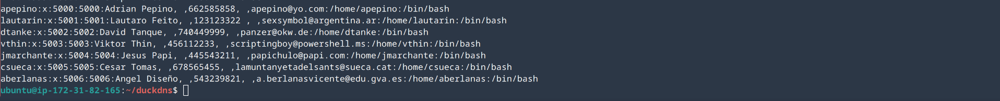
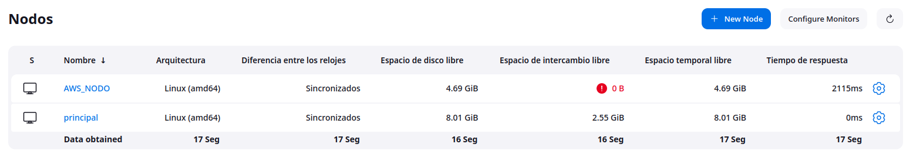
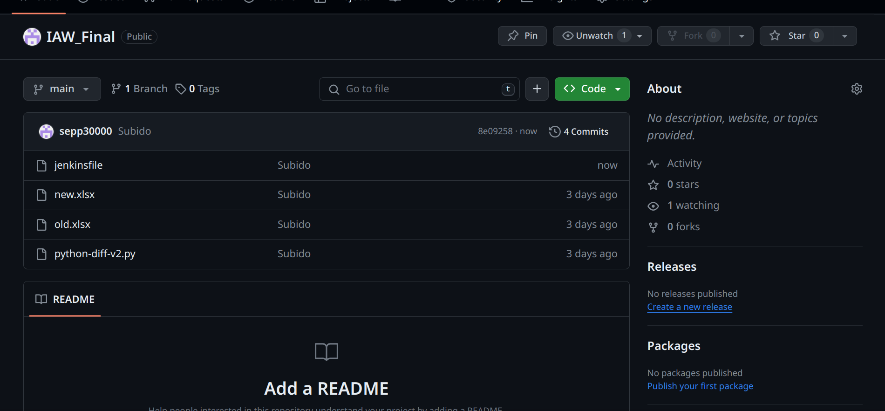

# Tarea Final

En esta tarea vamos a realizar una tarea que se ejecute en un nodo y conforme un script a ejecutar en el servidor. Después de esto se conformará un informe en formato pdf y se notificará el funcionamiento.

## Preparación del entorno 

Usaremos una instancia de **AWS** como servidor ("servjenkins.duckdns.org"). Aquí montaremos toda la estructura previa de usuarios para poder ejecutar el *meta-script*

Después de esto, otra instancia de **AWS** será la que actuará como nodo (jenkinsasir.duckdns.org) en el que se realizarán las tareas de jenkins.

Para acabar crearemos un repositorio donde tendremos todos los archivos necesario (Excels, Scripts, Jenkinsfile ....)

Con esto ya tendriamos preparado el entorno para realizar las tareas.

## Tareas

### Tarea 1: Recoger el repositorio

Lo primero que haremos será recoger este repositorio. Así que crearemos un job con pipelines que usará como nodo nuestra instancia de **AWS**
y recoja nuestro repositorio de *GITHUB*.

