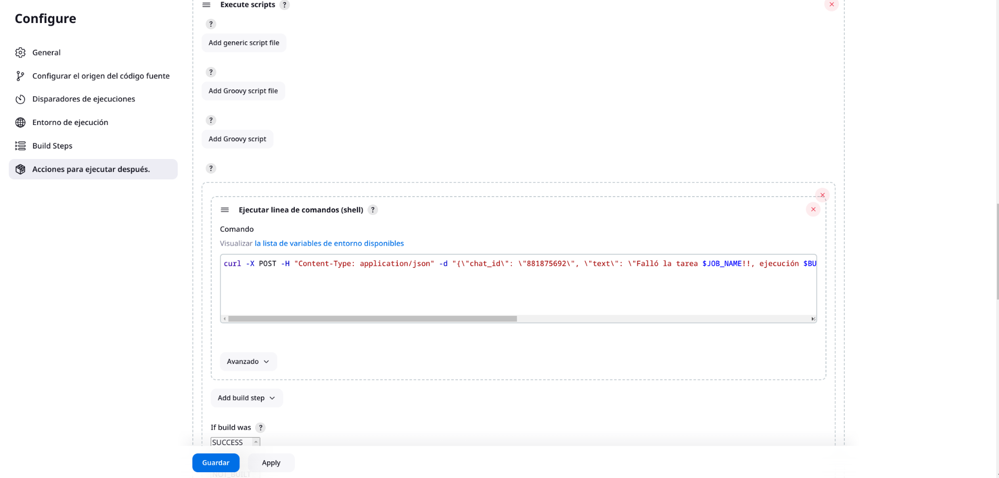

# Tarea 1: Job básico

En está tarea haremos el primer job con el fin de ver el funcionamiento de jenkins y comprobar las notificaciones que nos manda (Telegram)

## Configuración 

Lo primero que vamos es a configurar el job **tarea1**


En este caso al ser un job simple iremos direcatemente a *ejecutar linea de comendos (shell)*. Ahí escribiremos el script de los usuarios.

```bash
#!/bin/bash

# Obtener la lista de usuarios del sistema
users=$(getent passwd)

# Iterar sobre cada usuario
while IFS=: read -r username _ uid _ _ _ _; do
    # Verificar si el UID es mayor a 1005 (1005 es un ejemplo, usa el número correcto)
    if [ "$uid" -gt 1005 ]; then
        echo "Se ha creado un nuevo usuario: $username (UID: $uid)"
    fi
done <<< "$users"
```


Después vamos a los *pasos a ejecutar después* donde ejecutaremos otro comando en shell para mandar el mensaje en telegram.

```bash
curl -X POST -H "Content-Type: application/json" -d "{\"chat_id\": \"VUESTRO_ID\", \"text\": \"Falló la tarea $JOB_NAME!! $BUILD_NUMBER,  \", \"disable_notification\": false}" https://api.telegram.org/botVUESTRO_TOKEN/sendMessage
```



Haremos dos uno en caso de que falle y otro para cuando funciona bien.

```bash
curl -X POST -H "Content-Type: application/json" -d "{\"chat_id\": \"VUESTRO_ID\", \"text\": \"Funciona la tarea $JOB_NAME!! $BUILD_NUMBER,  \", \"disable_notification\": false}" https://api.telegram.org/botVUESTRO_TOKEN/sendMessage
```

Con todo esto ya podemos ejecutar la tarea.

## Pruebas

Ahora que lo tenemos terminado probamos que funciona.


Y con esto tenemos terminada la tarea.

---

