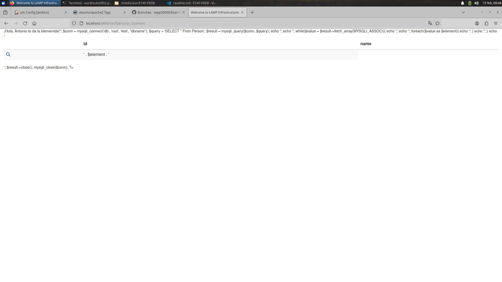

# Tarea 2: Freestyle job - despliegue web/git

Si no tienes creado ningún volumen con el docker de jenkins. Lo mejor es que crees uno nuevo.

```bash
docker run -v /home/sepp/Documentos/jenkins/:/var/jenkins_home/workspace/ --name jenkins_3 -p 8080:8080 -p 50000:50000 -p 2222:22 jenkins/jenkins
```

En la tarea 2 vamos a recoger un repositorio de github para después contactar con el servidor apache y así comprobar el funcionamiento.

## Crear el job

1. Creamos el job **vas** y copiamos el repositorio de nuestro examen de php.


2. Le damos permisos totales a la carpeta del volumen para que funcione sin problemas.

```bash
chmod 777 /jenkins
```

3. Probamos que funciona el job


4. Creamos el contenedor de apache y comprobamos el que saca la web.

```bash
```




