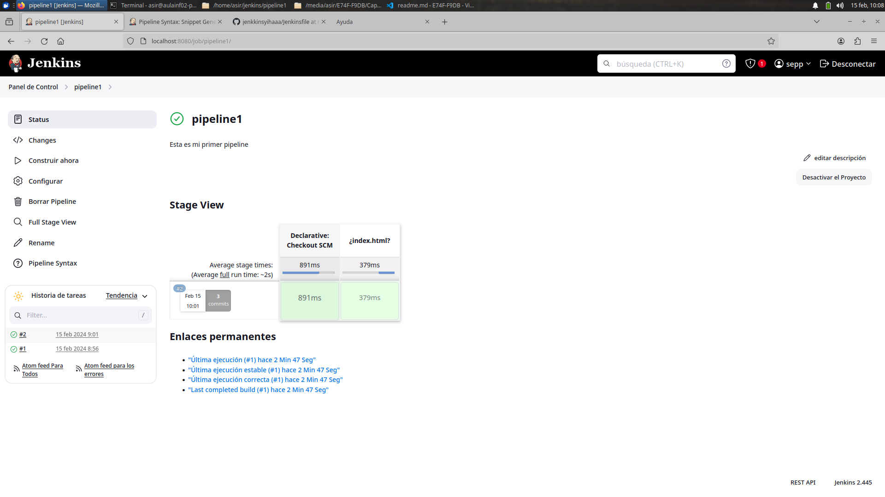

# Tarea 3: Tarea 2 con Pipelines

En esta tarea haremos lo mismo que en la anterior pero con Tuberias.

## Descargamos el repositorio de LAMP y cambiamos el compose para que el volumen sea igual que el de jenkins

```bash
version: "3.1"
services:
    db:
        image: mysql
        ports: 
            - "3306:3306"
        command: --default-authentication-plugin=mysql_native_password
        environment:
            MYSQL_DATABASE: dbname
            MYSQL_PASSWORD: test
            MYSQL_ROOT_PASSWORD: test 
        volumes:
            - ./dump:/docker-entrypoint-initdb.d
            - ./conf:/etc/mysql/conf.d
            - persistent:/var/lib/mysql
        networks:
            - default
    www:
        build: .
        ports: 
            - "80:80"
        volumes:
            - /home/asir/jenkins:/var/www/html
        links:
            - db
        networks:
            - default
    phpmyadmin:
        image: phpmyadmin/phpmyadmin
        links: 
            - db:db
        ports:
            - 8000:80
        environment:
            MYSQL_USER: root
            MYSQL_PASSWORD: test
            MYSQL_ROOT_PASSWORD: test 
volumes:
    persistent:
```

De esta manera el LAMP y Jenkins comparten el mismo volumen

## Creamos el job

Ahora que los dos contenedores comparten volumen ya podemos crear el job con pipeline.


Indicamos las opciones:

- Definitio: Pipeline script from SCM
- SCM: Git
- Repository URL: https://github.com/sepp30000/jenkkinsyihaaa.git
- Branch: */main
- Script path: Jenkinsfile


Después de esto tendremos en el repositorio de **GitHub** un *jenkinsfile* con la configuración.

```bash
pipeline {
  agent any
  stages {
    stage('¿index.html?') {
      steps {
        sh '''#!/bin/bash
        index=/var/www/index.html
	    ws=/var/jenkins_home/workspace/pipeline1
	    if [ -e $index ]; then rm -rf $index; fi'''
      }
    }
  }
}
```


Y un HTML

```html
<!doctype html>
<html>
  <head>
    <title>Ayuda</title>
  </head>
  <body>
    <p>Necesito ayuda con esto</p>
  </body>
</html>
```

Con esto ya podemos ver si funciona




Y vemos que funciona

