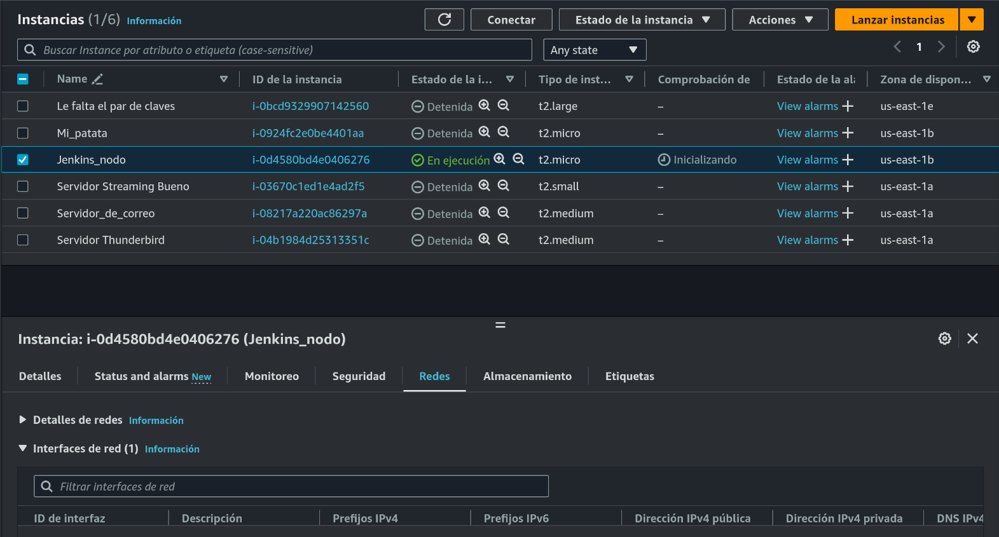
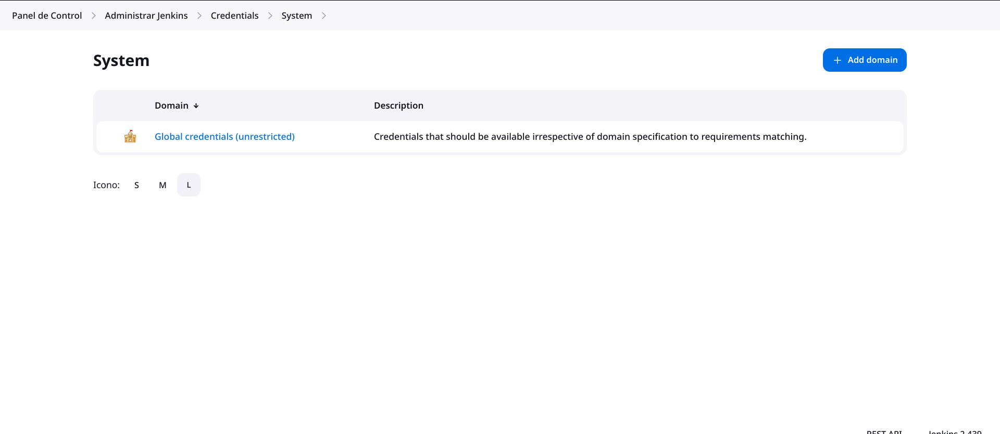
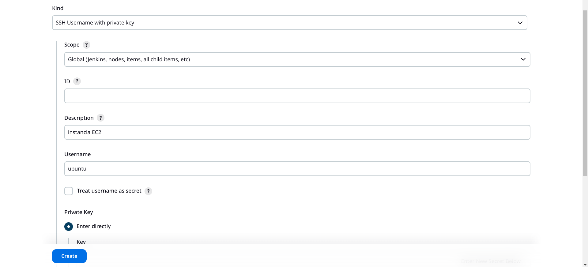
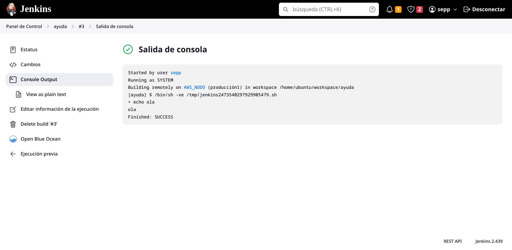
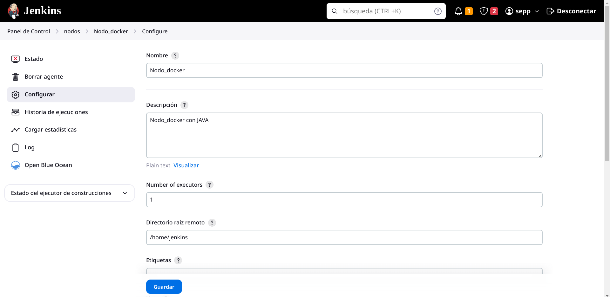
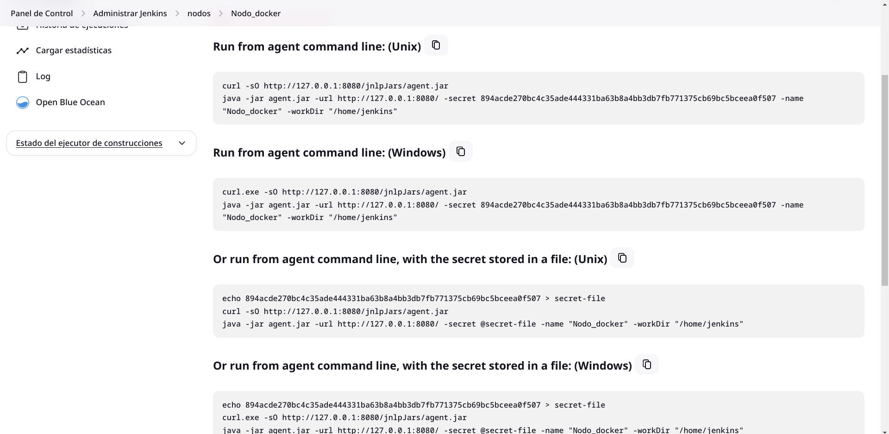
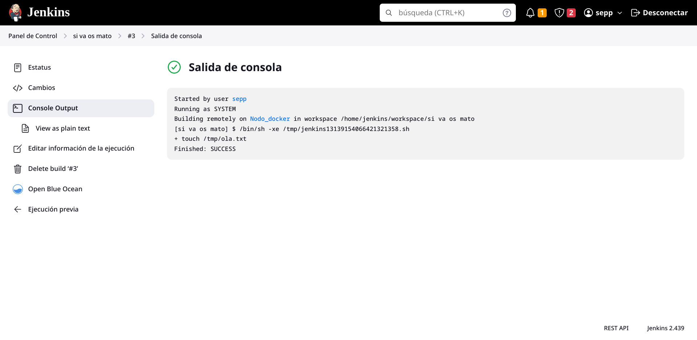
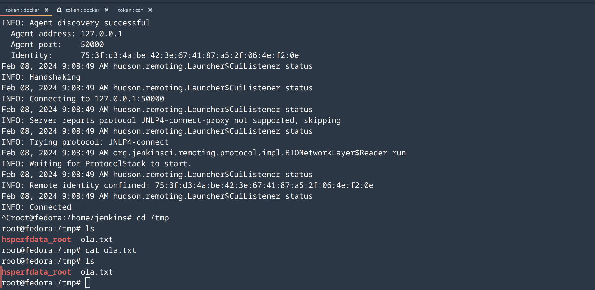

# Tarea nodos Jenkins

## Documentación util

[Creación de nodo en AWS](http://codigoelectronica.com/blog/crear-nodo-en-jenkins-para-conectar-instancia-ec2-de-aws)

**Instancia AWS**

## Creamos una instancia en AWS

Nuestro primer paso es tener una instancia de AWS creada para poder realizar los nodos



## Instalamos java

```bash
    sudo apt install default-jre
```

## Crear credenciales

Una vez creada la instancia, nos vamos a Jenkins para crear las credenciales necesarias para crear los nodos **Administrar Jenkins > Credenciales > Sistema** y clickamos en *global credentials*.



Después clickamos en **Add Credentials**



## Crear nodo

Vamos a **Administrar Jenkins > Administrar nodos > Nuevo nodo**


## Pruebas



**Agent Java**

## Nos creamos un docker e instalamos **default-jre**

```bash
apt install default-jre
```

## Entramos en Jenkins y creamos un nuevo nodo



## Ejecutamos los comandos en el nodo



## Creamos un job y vemos que funciona



