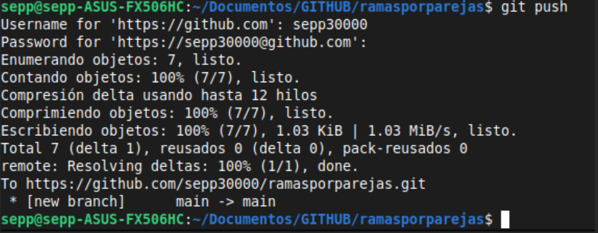
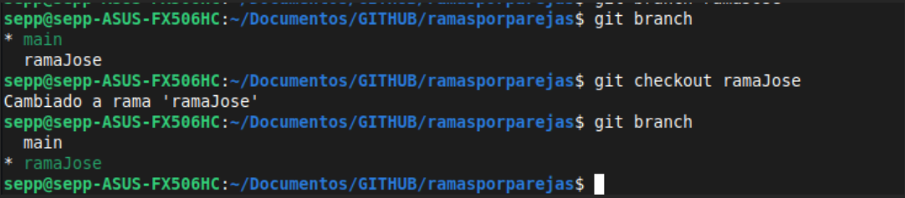
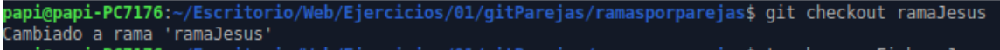
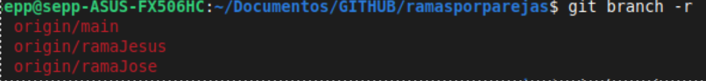
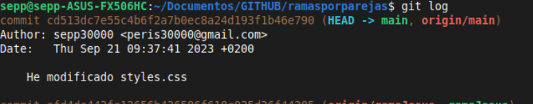
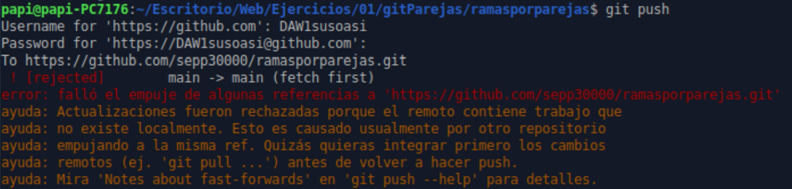
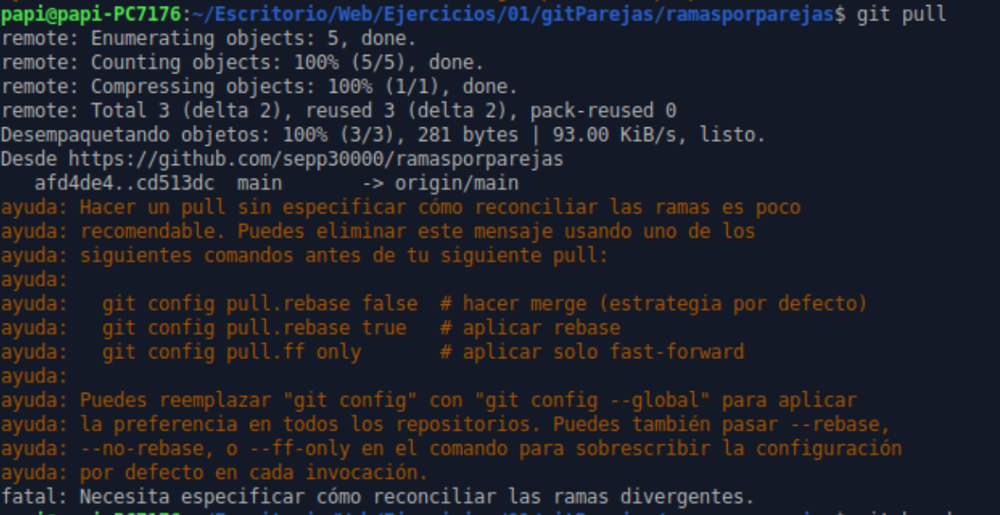

# Trabajo con ramas

## En esta tarea veremos como se trabajan las ramas y como relizamos las pruebas pertinentes

### 1. Creamos el repositorio

- **Creamos** el repositorio "ramas por parejas".
  


### 2. Invitamos a un colaborador

- Después de crear el repositirio, invitamos a nuestro compañero **Jesús** al repositorio ***"ramas por parejas."***


### 3. Creamos un ***html*** y ***css*** básico

#### HTML

```html
<!DOCTYPE html>
<body>
<header>
    <h1>Header</h1>
</header>

<main>
    <section>
        <h2>Contenido Principal</h2>
        <p>Este es el contenido principal de la página.</p>
    </section>
</main>

<aside>
    <h3>Barra lateral</h3>
    <ul>
        <li>Enlace 1</li>
        <li>Enlace 2</li>
        <li>Enlace 3</li>
    </ul>
</aside>

<footer>
    <p>Pie de página</p>
</footer>
</body>
</html>
```

#### CSS

```css
/* Estilos para el header */
header {
    background-color: #3498db;
    color: #fff;
    padding: 20px;
    text-align: center;
}

/* Estilos para el main */
main {
    background-color: #ecf0f1;
    padding: 20px;
}

    /* Estilos para el aside */
aside {
    background-color: #2ecc71;
    color: #fff;
    padding: 20px;
}

    /* Estilos para el footer */
footer {
    background-color: #34495e;
    color: #fff;
    padding: 10px;
    text-align: center;
}
```

### 4. Volcamos a github

- Después de crear los archivos ***html y css*** los volcamos al repositorio de **github**.



### 5. Trabajo con las ramas

#### Después de volcar el repositorio, trabajaremos con las ramas y  buscaremos los fallos

- Creamos **rama_jose** y nuestro compañero creará **rama_jesus**.
  


- El compañero crea su rama



- Comprobamos las ramas creadas



- Modificamos el fichero desde nuestra rama, lo unimos a la rama principal y lo volvemos a subir a **github**



- El compañero después de modificar el ***css*** lo desde su rama, lo une con la rama principal con el fin de hacer un push (tendrá un problema ya que el tiene una versión anterior de la rama main, por lo tanto le marcará un error a la hora de subir al main)



---

> ¿Como lo solucionamos?

<center> Esto se debe a que en para poder subir un archivo a la rama deseada debe estar sincronizado anteriormente con dicha rama. Si no se hace así tendremos problemas a la hora de hacer push (Tenemos que vivir en la versión más actualizada y hacer pull constantemente).</center>

### 6. Git pull para sobrescribir

- Hacemos un **git pull** de main, esto hará un merge con el fin de solucionar el problema anterior y  poder subir nuestra versión modificada a github



- Despues de esto tenemos que tener claro que hay que cuando se trabaje en equipo hay que tener constante comunicación e ir con cuidado a la hora de hacer merge a la rama principal.

Aquí enlazaremos con el markdown auxiliar en el que hemos hecho pruebas.

[Pruebas markdown 2](pruebas.md)
