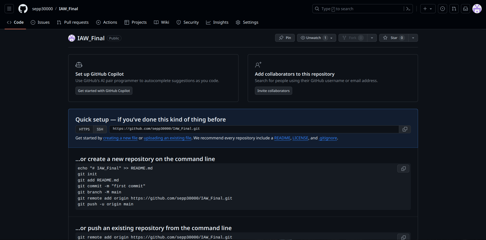
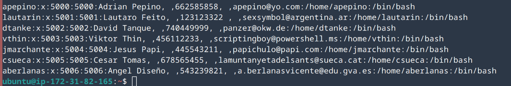

# Tarea final IAW

## Crear un repositorio para la tarea final

Para empezar crearemos un repositorio llamada **IAW_Final**.



[Repositorio](https://github.com/sepp30000/IAW_Final)

## Preparación del entorno 

Antes de ponernos manos a la obra, prepararemos una instancia de AWS que actuará como servidor. En este servidor, montaremos los usuarios necesarios para empezar.


Nos hacemos un dominio dinámico para no tener problemas a la hora de ejecutar la tarea **servjenkins.duckdns.org**

```bash
ssh -i NGINX.pem ubuntu@servjenkins.duckdns.org
```

Hecho esto crearemos los usuarios del xls





# Importabte 
```bash
scp -i puto.pem -p /home/sepp/Documentos/token/puto.pem  ubuntu@jenkinsasir.duckdns.org:/home/ubuntu/puto.pem
```