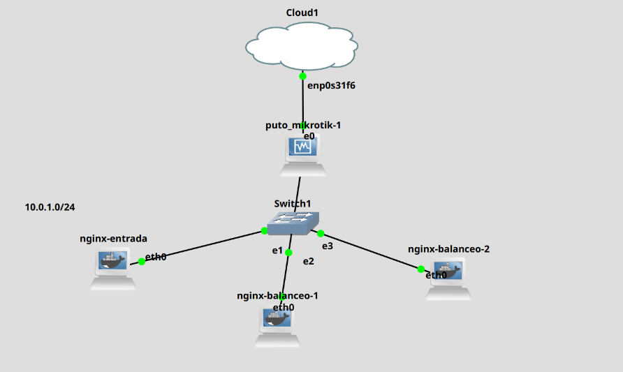

# UD4 – Implantación de soluciones de alta disponibilidad
## Tarea 1 – Balanceo de carga en NGINX

En esta práctica realizaremos un balanceo de carga con contenedores de NGINX

### 1. Creación de proyecto en GNS3

Creamos un proyecto de GNS3 con 3 contenedores dentro de la red 10.0.1.0/24. Estos contenedores de NGINX una actuará de servidor principal y los otros harán el balanceo de carga.



### 2. Configuracion del docker 

En el contenedor principal iremos **/etc/nginx/nginx.conf** y realizaremos la siguiente configuración.

#### Round Robin

```bash
user  nginx;
worker_processes  auto;

error_log  /var/log/nginx/error.log notice;
pid        /var/run/nginx.pid;

events {
    worker_connections  1024;
}

http {
    include       /etc/nginx/mime.types;
    default_type  application/octet-stream;

    log_format  main  '$remote_addr - $remote_user [$time_local] "$request" '
                      '$status $body_bytes_sent "$http_referer" '
                      '"$http_user_agent" "$http_x_forwarded_for"';
    access_log  /var/log/nginx/access.log  main;

    sendfile        on;
    #tcp_nopush     on;
    keepalive_timeout  65;

    #gzip  on;
    # Configuración del balanceador de carga
    upstream myproject {
        server 10.0.1.10 weight=3;
        server 10.0.1.20;
        server 10.0.1.30;
    }

    server {
        listen 80;

        location / {
            proxy_pass http://myproject;
        }
    }
}
```

#### Least Connections

```bash
user  nginx;
worker_processes  auto;

error_log  /var/log/nginx/error.log notice;
pid        /var/run/nginx.pid;

events {
    worker_connections  1024;
}

http {
    include       /etc/nginx/mime.types;
    default_type  application/octet-stream;

    log_format  main  '$remote_addr - $remote_user [$time_local] "$request" '
                      '$status $body_bytes_sent "$http_referer" '
                      '"$http_user_agent" "$http_x_forwarded_for"';
    access_log  /var/log/nginx/access.log  main;

    sendfile        on;
    #tcp_nopush     on;
    keepalive_timeout  65;

    #gzip  on;
    # Configuración del balanceador de carga
    upstream myproject {
        least_conn
        server 10.0.1.10 weight=3;
        server 10.0.1.20;
        server 10.0.1.30;
    }

    server {
        listen 80;

        location / {
            proxy_pass http://myproject;
        }
    }
}
```


### 3. Comprobación del funcionamiento

Le decimos a un compañero que lo pruebe para ver su funcionamiento


