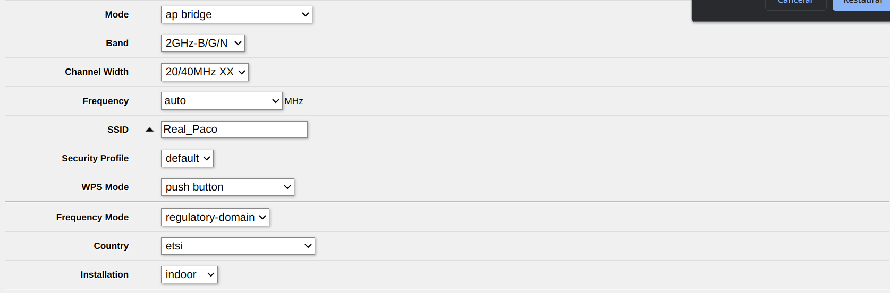
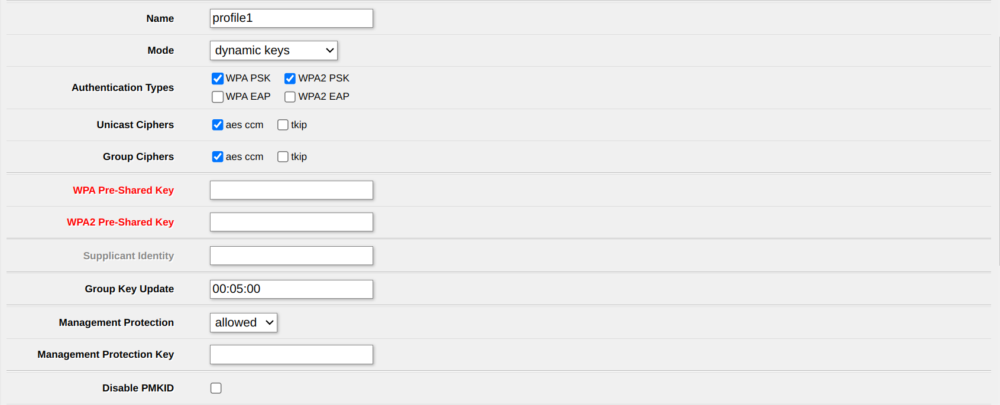
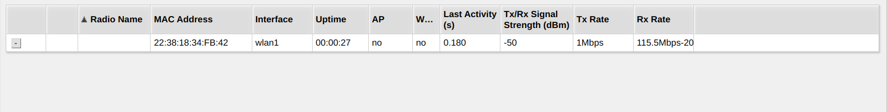

# Tarea 6 - Seguridad en redes inalámbricas

## 1. Creamos la red en WIFI con el SSID ***Real_Paco***

Para cambiar el SSID nos iremos a *WIRELESS* y seleccionamos la interfaz **wlan1**. Dentro 

Luego configuramos un grupo de seguridad, para ello nos vamos a **security profile**, **add new** e insertamos la contraseña. 

Después de crear el perfil de seguridad se lo asignamos a la red. Tendremos que volver a la red y a security profile para asignarle el perfil creado. Con esto tendremos contraseña en nuestra red wifi.

## 2. Filtrado por MACs

Después de conectarnos a la red **Real_Paco** iremos a *Registration* 

Clickamos dentro y le damos a las opciones *Copy to access list* y *Copy to connect list*

De esta manera agregaremos los dispositivos a la seguridad