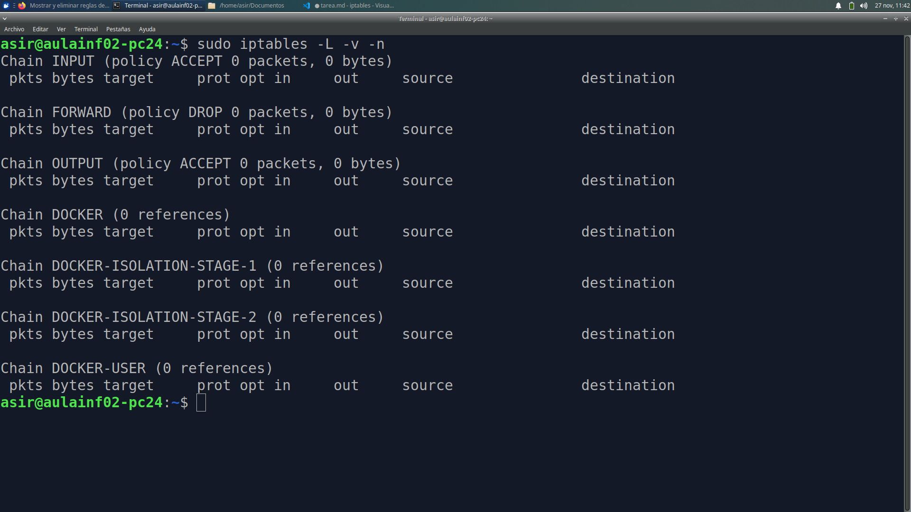
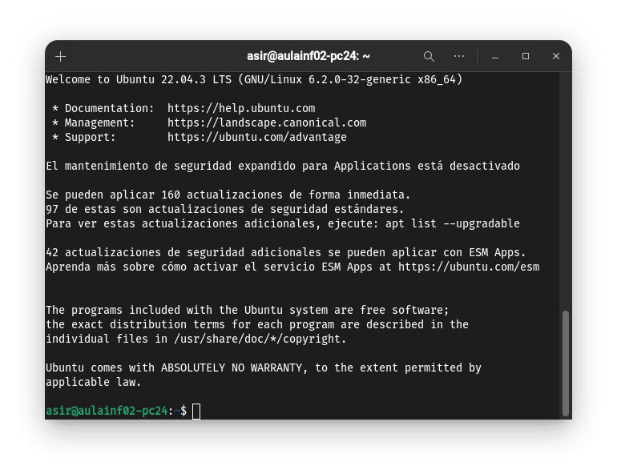
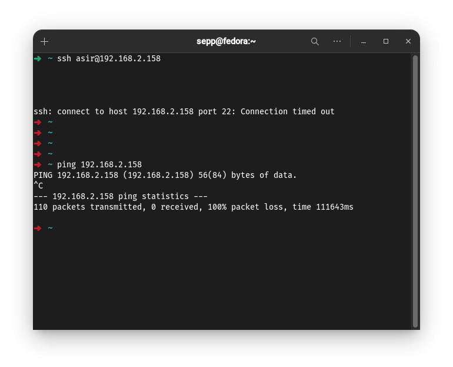
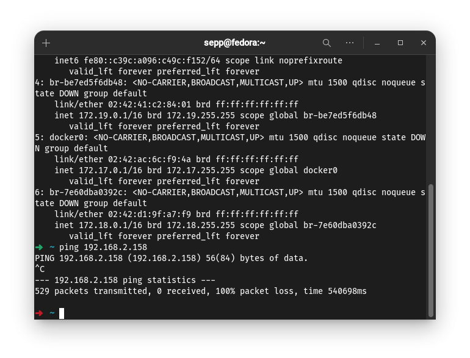
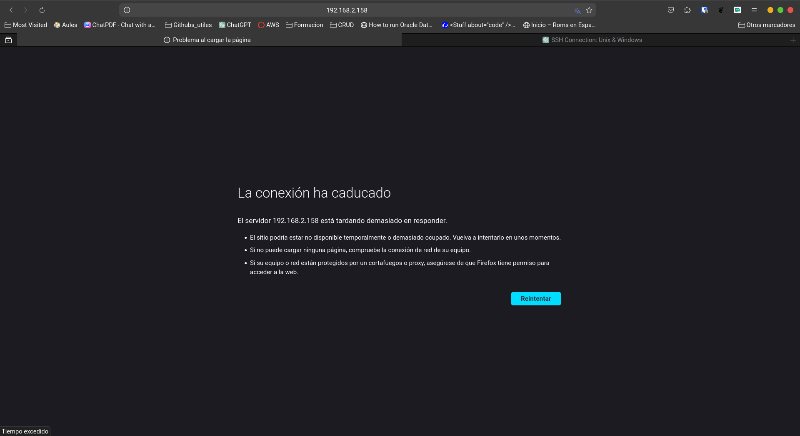
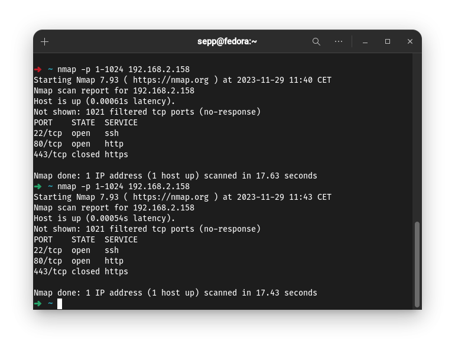
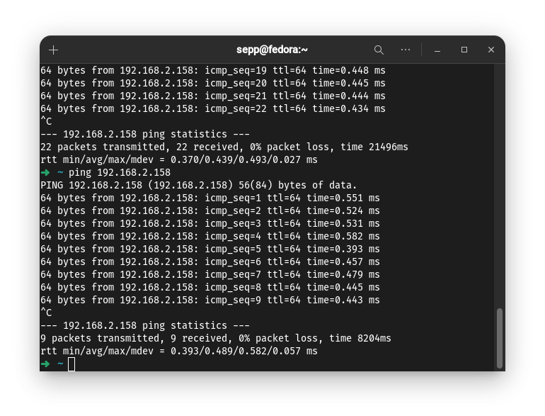
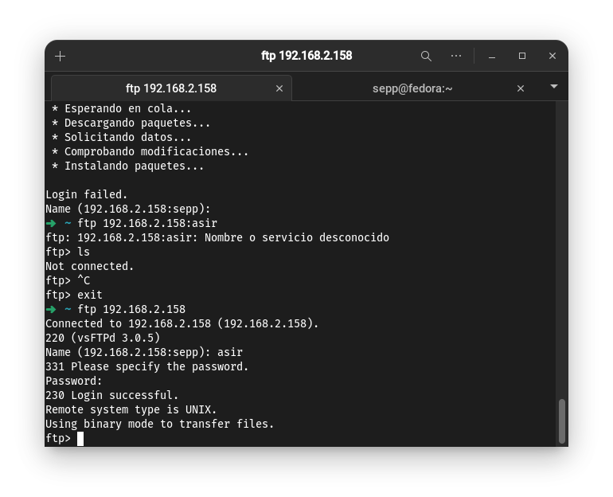
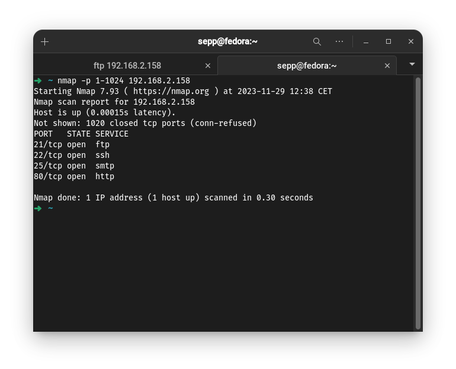

# Tarea 1 - Retos de cortafuegos básico

## Crear copia de seguridad del iptables

```bash
    sudo iptables-save > /home/asir/Documentos/rules.v4
```

### 1.Limpia todas las reglas al Servidor y tendremos el firewall sin ninguna regla y parado.

```bash
    sudo iptables -F
```

### 2. Mira el estado actual de las reglas con "iptables -L -v -n".

```bash
    sudo iptables -L -v -n
```



### 3. En otro equipo virtual Ubuntu (será "Cliente") instala el software nmap. Nos servirá para hacer escaneo de puertos y comprobar si se puede acceder a los servicios del servidor de nuestro compañero y el nuestro.

```bash
nmap -p 1-1024 192.168.2.158
```

- Estan abiertos los puertos 22, 25, 80.
  
### 4. Si las políticas por defecto del servidor no son ACCEPT en INPUT, OUTPUT y FORWARD, poned a todas ACCEPT.

```bash
sudo iptables -P INPUT ACCEPT
sudo iptables -P OUTPUT ACCEPT
sudo iptables -P FORWARD ACCEPT
```

### 5. Instala Apache y openssh-server en el Servidor.

```bash
    sudo apt install apache2 openssh-server
```

### 6. Comprueba que puedes ver los servicios activos desde el Cliente, accediendo con un navegador web y un cliente ssh al servidor de nuestro compañero.

- Nos conectamos a la ip del ordenados y accedemos a la web del apache


- Y para el ssh utilizamos 

```bash
    ssh asir@192.168.2.158
```

- Estaremos dentro




### 7. Comprueba también que nmap te muestra que los puertos de los servicios web y sshd están abiertos (escuchando).

- En la tarea 2 veo que ya estan abiertos

### 8. Ahora cambia la configuración del firewall para cerrar el acceso al servidor. Pon en iptables que la política en INPUT, OUTPUT y FORWARD sea por defecto DROP. Comprueba el estado actual del firewall.

```bash
    sudo iptables -P INPUT DROP
    sudo iptables -P OUTPUT DROP
    sudo iptables -P FORWARD DROP
```

- Con estas 3 reglas no permitimos la entrada de nadie.

### 9. Desde el cliente comprueba que los puertos de los servicios ya no son accesibles y tampoco se puede acceder con los clientes web y ssh. Comprueba que tampoco puedes acceder desde el servidor en la red, haciendo un ping al cliente.



### 10.  Permite el acceso a la máquina server solo desde la dirección IP de la máquina cliente del compañero a cualquier protocolo (recuerda, hay que activar la petición y la respuesta).

```bash
    sudo iptables -A INPUT -p tcp --dport 22 -s 192.168.2.192 -j ACCEPT
    sudo iptables -A OUTPUT -p tcp --sport 22 -d 192.168.2.192 -j ACCEPT
    sudo iptables -A INPUT -m state --state ESTABLISHED,RELATED -j ACCEPT
    sudo iptables -A OUTPUT -m state --state ESTABLISHED,RELATED -j ACCEPT
```

- Con esto hemos realizado un ssh desde nuestra maquina y desde la de un compañero, el resultado es que desde 192.168.2.192 funciona el ssh y desde la ip diferente no


### 11.  Comprueba que no se puede acceder por ejemplo desde nuestro cliente (ping, cliente web) a nuestro propio servidor, y un scan con nmap te dará todos los puertos cerrados. En cambio desde el cliente del compañero se tiene que poder.




### 12.  Permite el acceso a la máquina servidor solo a los puertos de los servicios Web (80, 443) y SSH (22), desde cualquier equipo, y prueba que ahora desde el cliente del compañero puedes acceder a los servicios web y ssh, pero que no puedes hacer un ping, por ejemplo. Comprueba también con nmap.

- Limpiamos las reglas y establecemos las que nos pide
  
```bash
    sudo iptables -F
```

- Politicas predeterminadas

```bash
    sudo iptables -P INPUT DROP
    sudo iptables -P FORWARD DROP
    sudo iptables -P OUTPUT DROP
```

```bash
    sudo iptables -A INPUT -p tcp --dport 80 -j ACCEPT
    sudo iptables -A INPUT -p tcp --dport 443 -j ACCEPT
    sudo iptables -A INPUT -p tcp --dport 22 -j ACCEPT

    sudo iptables -A INPUT -m state --state ESTABLISHED,RELATED -j ACCEPT
    sudo iptables -A OUTPUT -m state --state ESTABLISHED,RELATED -j ACCEPT
```

- Despues de vemos que todo funciona como queremos y el nmap funciona (El puerto 443 no sale abierto porque en apache no esta habilitado el **https**)



### 13.  Prueba a poner solo la regla de la cadena INPUT. ¿Funciona el servicio web? ¿Por qué?

- Si ponemos solo las reglas **INPUT**, no funcionará, ya que al ser una comunicación entre los dos equipos, llegarán los paquetes pero no saldrán, por lo tanto el apache no funcionará

### 14. Permite hacer ping a la máquina servidor (busca los icmp-type del ping), desde el cliente del compañero, y prueba que ahora desde el tuyo si puedes hacer ping.

```bash
    sudo iptables -A INPUT -p icmp --icmp-type echo-request -j ACCEPT
    sudo iptables -A OUTPUT -p icmp --icmp-type echo-reply -j ACCEPT
```

- Con esto activa los pings

- Y ya podemos hacer pings



### 15. Si queremos denegar que se pueda hacer un ping, ¿tendremos que hacer dos reglas INPUT y OUTPUT o solo con INPUT ya denegamos? ¿Por qué?

- Al igual que en la tarea 13, si denegamos la entrada, como el paquete no llega. Tampoco responde, por lo tanto no funcionará el ping

### 16. Activa ahora el servicio FTP del servidor y limita el acceso al servidor FTP al cliente de tu compañero.

- Primero abrimos otra vez el firewall

```bash
    sudo iptables -F
    sudo iptables -P INPUT ACCEPT
    sudo iptables -P OUTPUT ACCEPT
    sudo iptables -P FORWARD ACCEPT
```

- Instalar **vsftpd**

```bash
    sudo apt install vsftpd
```

#### 16.1 Piensa que el protocolo FTP usa 2 puertos, el 20 y el 21 (en modo activo).

```bash
    sudo iptables -A INPUT -p tcp --dport 20 -s 192.168.2.158 -j ACCEPT
    sudo iptables -A OUTPUT -p tcp --sport 20 -d 192.168.2.158 -j ACCEPT
    sudo iptables -A INPUT -p tcp --dport 21 -s 192.168.2.158 -j ACCEPT
    sudo iptables -A OUTPUT -p tcp --sport 21 -d 192.168.2.158 -j ACCEPT
```

```bash
# Para el modo pasivo
    sudo iptables -A INPUT -p tcp --sport 1024:65535 -m state --state ESTABLISHED,RELATED -j ACCEPT
    sudo iptables -A OUTPUT -p tcp --dport 1024:65535 -m state --state NEW,ESTABLISHED -j ACCEPT
```

```bash
    sudo iptables -A INPUT -m state --state ESTABLISHED,RELATED -j ACCEPT
    sudo iptables -A OUTPUT -m state --state ESTABLISHED,RELATED -j ACCEPT
```

```bash
    sudo iptables -P INPUT DROP
    sudo iptables -P FORWARD DROP
    sudo iptables -P OUTPUT DROP
```


### 17. Comprueba desde tu cliente que no se puede acceder a FTP pero desde el cliente del compañero sí. Mira con nmap desde los dos equipos cliente (el tuyo y el del compañero).

- Nos conectamos por ftp

```bash
    ftp 192.168.2.158
```



  Y en el nmap se ve el puerto ftp



### 18. Haz que la configuración de iptables sea persistente al servidor. Comprueba reiniciando el servidor. Comprueba que las reglas iptables continúan existiendo. 

- Podemos tener varias opciones para que nuestras reglas sean persistentes en los equipos

1. Generar un **script** que exporte las reglas configuradas por nosotros y al arrancar el sistema estas reglas serán exportadas. Estás reglas se pueden ejecutar mediante **crontab** al inicio o convirtiendo esto en un servicio.

```bash
    crontab -e
    @reboot /iptables_script.sh
```

2. En sistemas basados en systemd, como muchas versiones modernas de Debian y Ubuntu, puedes usar el servicio iptables-persistent. 

Asegúrate de haber instalado el paquete iptables-persistent:

```bash
    sudo apt install iptables-persistent
```

Después de configurar tus reglas iptables, guarda los cambios:

```bash
    sudo service netfilter-persistent save
```

Este comando guardará las reglas iptables.

Para asegurarte de que las reglas se carguen al reiniciar, habilita el servicio:

```bash
    sudo systemctl enable netfilter-persistent
```
---