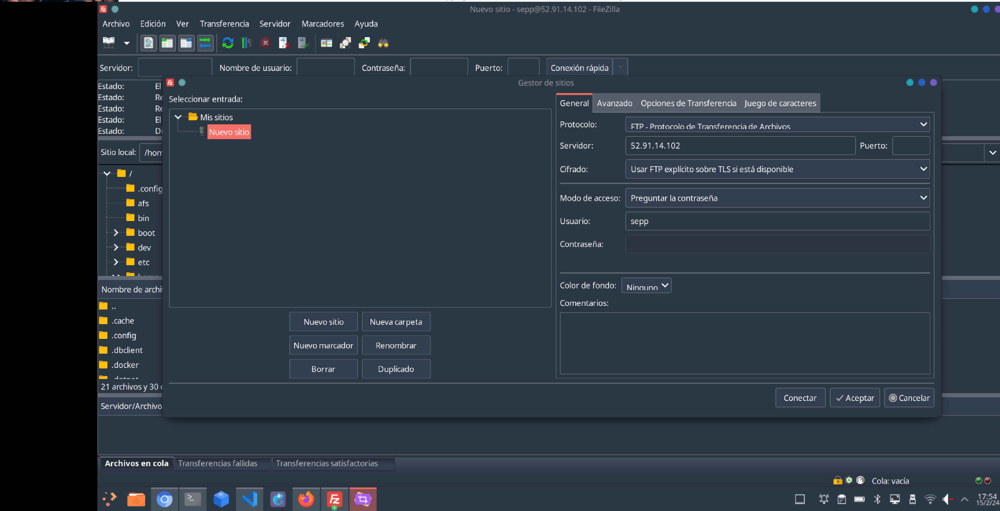
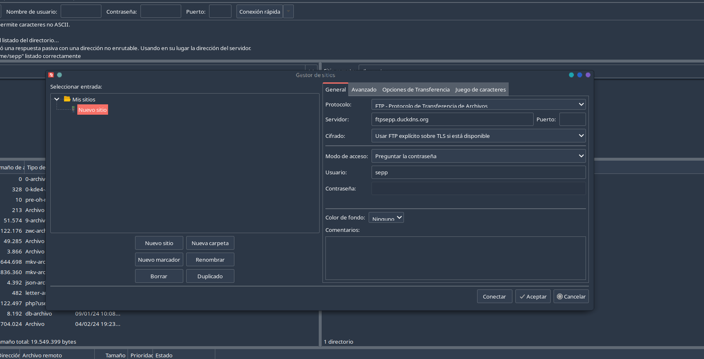
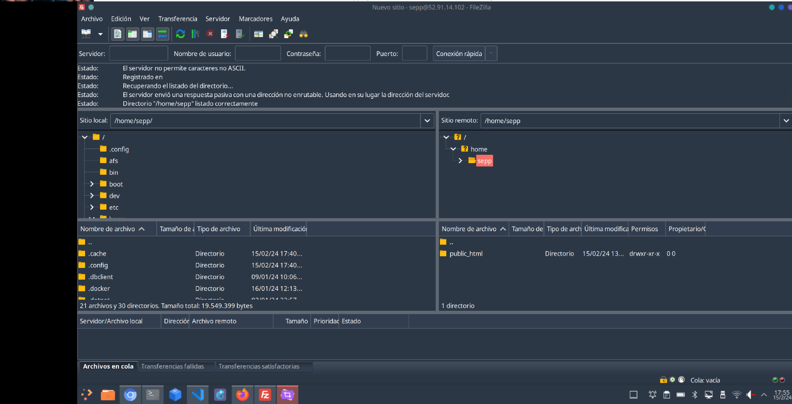
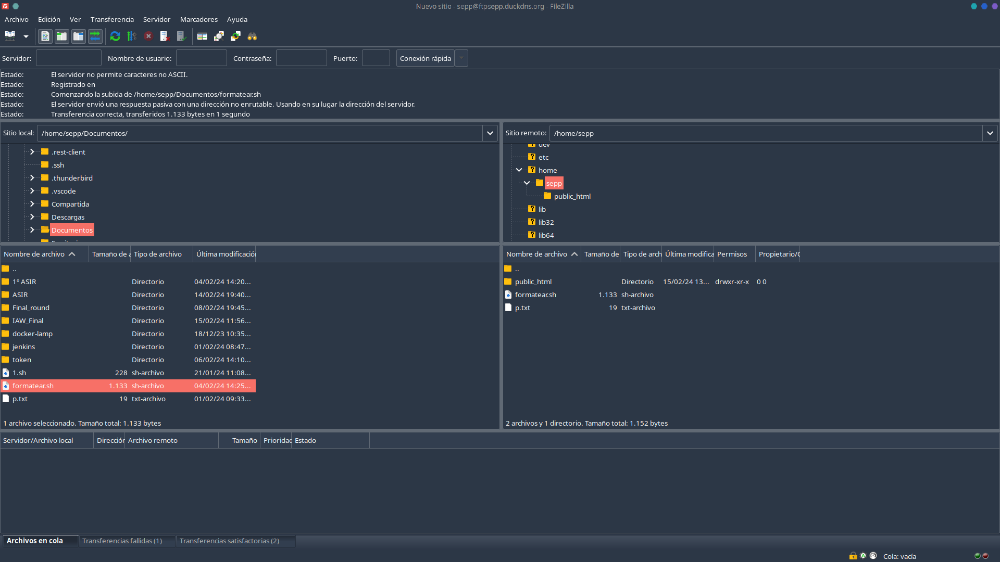
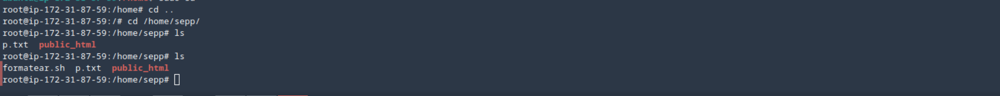

# Reto 2. FTP

Aquí crearemos un servidor FTPS Explicito en el que guardar los archivos enjaulados y nunca se podrá accedes por FTP.

## Preparar Entorno

En una instancia de AWS instalamos VSFTPD

```bash
    apt install vsftpd
```

## Configuración

Nos vamos a */etc/vsftp.conf* y le damos la siguiente configuración

```bash                               
listen=NO
listen_ipv6=YES
anonymous_enable=NO
local_enable=YES
write_enable=YES
dirmessage_enable=YES
use_localtime=YES
xferlog_enable=YES
chroot_local_user=YES
chroot_list_enable=YES
chroot_list_file=/etc/vsftpd.chroot_list
secure_chroot_dir=/var/run/vsftpd/empty
pam_service_name=vsftpd
rsa_cert_file=/etc/ssl/certs/vsftpd.pem
ssl_enable=YES

force_local_data_ssl=YES
force_local_logins_ssl=YES
ssl_ciphers=HIGH
require_ssl_reuse=NO
```

Creamos el archivo *vsftpd.chroot_list* e insertamos el usuario que ya tenemos creado.

```bash
sepp
```

Creamos el certificado

```bash
openssl req -x509 -nodes -newkey rsa:2048 -keyout vsftpd.pem -out vsftpd.pem -days 3650
```

Nos vamos a apache y creamos el *ftp.conf* para después activarlo.

```bash
ubuntu@ip-172-31-21-20:/$ cat /etc/apache2/sites-enabled/filezilla.conf

<VirtualHost *:80>
    ServerAdmin ftpsepp.duckdns.org
    DocumentRoot /home/sepp/public_html

    <Directory /home/sepp/public_html>
        Options Indexes FollowSymLinks
        AllowOverride None
        Require all granted
    </Directory>

    ErrorLog ${APACHE_LOG_DIR}/error.log
    CustomLog ${APACHE_LOG_DIR}/access.log combined
</VirtualHost>
```

```bash
a2ensite ftp.conf
```

## Funcionamiento

Nos vamos a Filezilla y iniciamos sesión.









