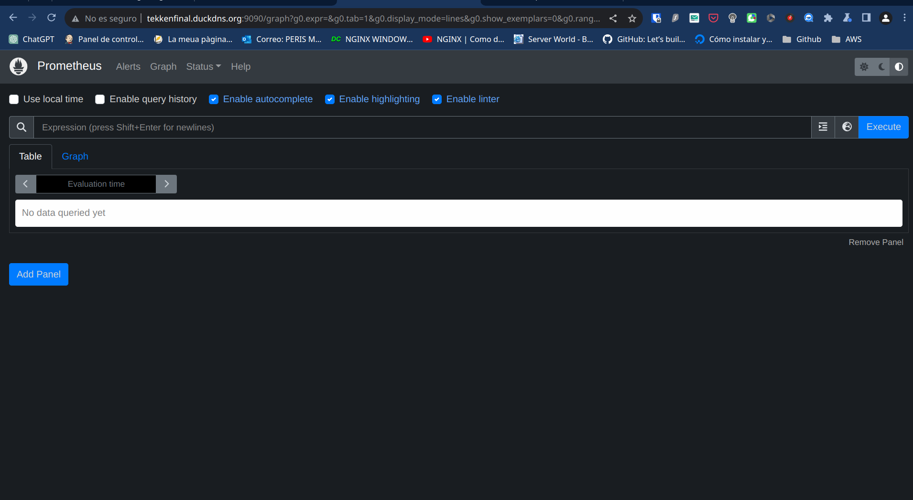
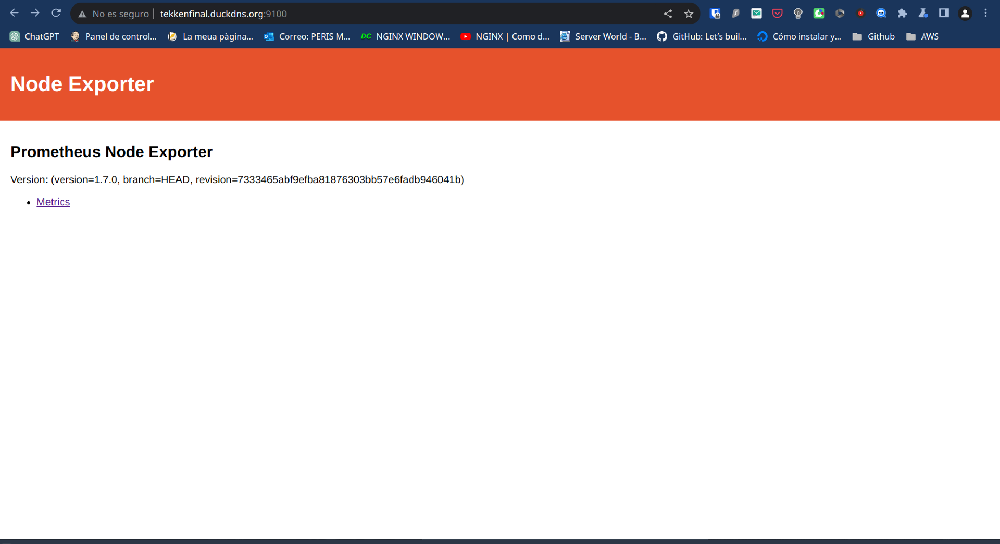
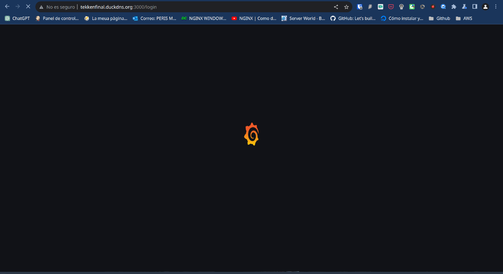
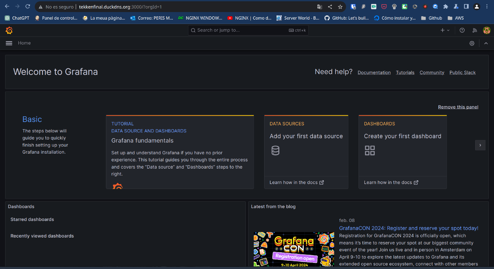
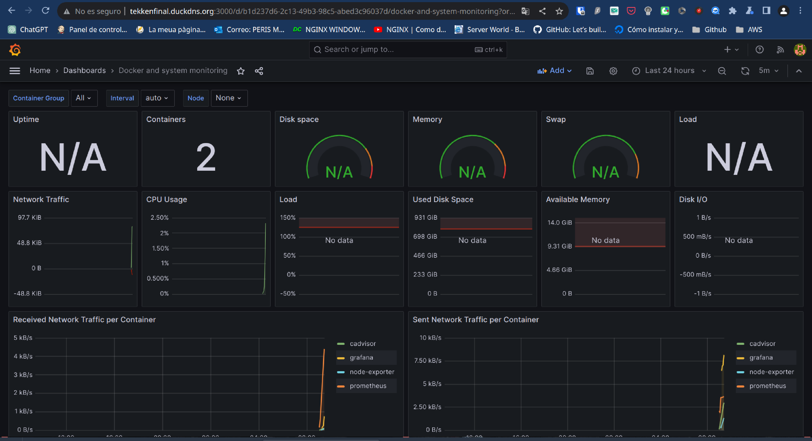
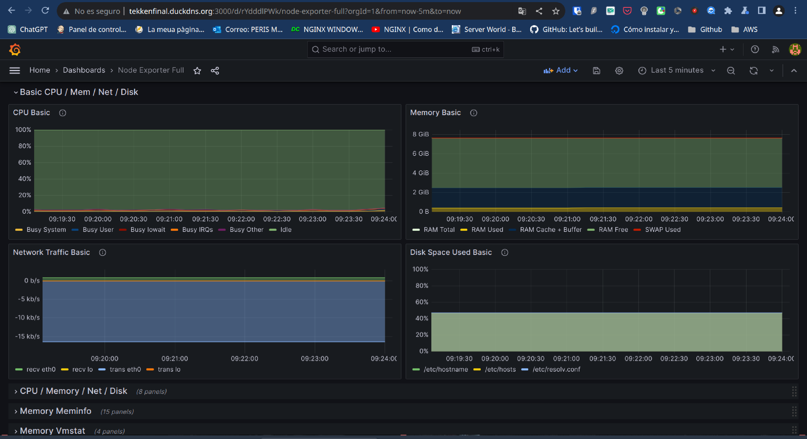

# Reto 7. Monitorización de un servidor

[Información util](https://www.webhi.com/how-to/docker-monitoring-using-prometheus-cadvisor-node-exporter-grafana/)

En el reto final vamos a realizar la monitorización de un servidor. Para ello utilizaremos la documentación util proporcionada por el profesor

## Instalamos docker

Esta tarea la realizaremos en una instancia de AWS en la que instalaremos docker.

```bash
apt install docker.io

sudo usermod -aG docker ubuntu 

sudo chmod 666 /var/run/docker.sock

```

## Creación de la red de monitoreo y contenedores

Ahora crearemos la red donde se ubicarán todos los contenedores, para posteriormente crear los contenedores necesarios.

```bash
docker network create patata
```

### Prometheus

Con la red creada, nos disponemos a crear el primer contenedor. En este caso es el contenedor de **Prometheus**

```bash
# Nos descargamos la imagen
docker pull prom/prometheus:latest

# Hacemos el directorio persistente
mkdir -p /prometheus-data

# El archivo .yml de configuración
nano prometheus.yml
```

**¡¡Acuerdate de abrir los puertos en AWS!!**

Docker run
```bash
docker run -d --name=prometheus 
    --network=patata
    -p 9090:9090 
    -v=/prometheus-data:/prometheus-data prom/prometheus:latest 
    --config.file=/prometheus-data/prometheus.yml 
```



### cAdvisor

Ya con Prometheus en funcionamiento. Hacemos lo mismo con cAdvisor

```bash
docker pull gcr.io/cadvisor/cadvisor:latest
```

Docker run
```bash
docker run --name=cadvisor 
    --network=patata 
    --volume=/:/rootfs:ro 
    --volume=/var/run:/var/run:rw 
    --volume=/sys:/sys:ro 
    --volume=/var/lib/docker/:/var/lib/docker:ro 
    p=8080:8080 
    --detach=true gcr.io/cadvisor/cadvisor:latest
```

### Node exporter
```bash
docker run -d
  --name=node-exporter  
  --network=patata
  -p 9100:9100
  prom/node-exporter:latest
```



### Graphana

```bash
docker run -d
  --name=grafana
  -p 3000:3000  
  --network=patata
  grafana/grafana:latest
```



Ahora nos logueamos en graphana.



Vamos a **Add data source**

Le damos a prometheus y lo configuramos


Ahora añadimos los dashboards




 