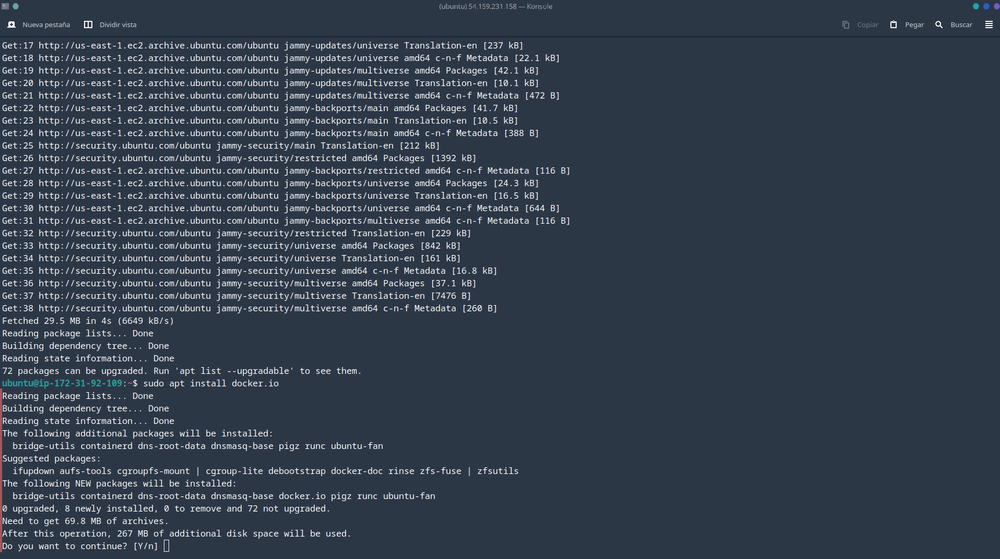
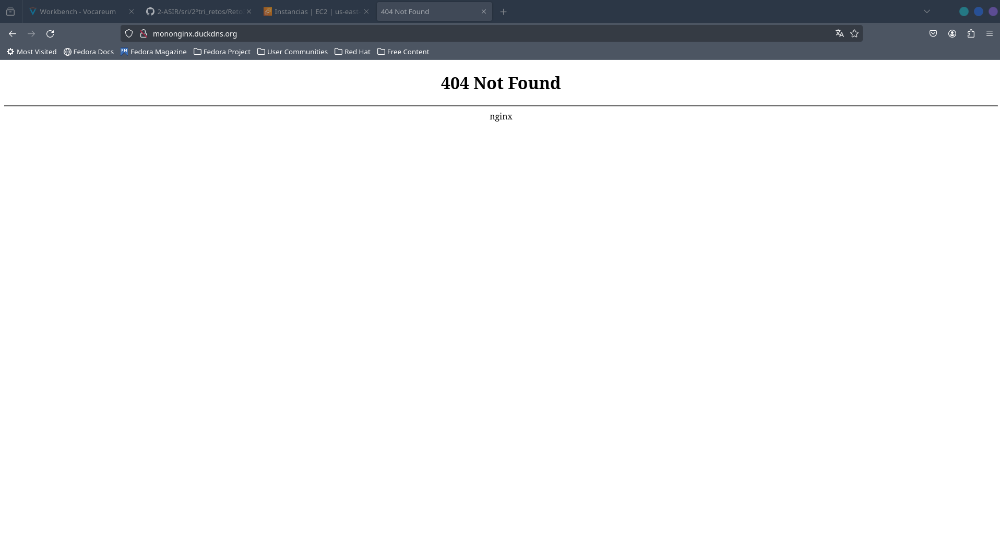

# Reto 4. WEB externa

En esta tarea crearemos una instancia de AWS en la que instalaremos *Docker* para montar un contenedor de *Nginx* Para montar un dominio dinámico y con certificados para ser segura la WEB.

## Preparación de entorno

Entramos en la instancia de AWS y ejecutamos.

```bash
apt update
apt install docker.io docker-compose
```



Creamos la estructura del docker compose para usar contenedores de certbot y nginx

```bash
mkdir docker-compose
# Dentro de compose
mkdir certbot nginx
# Dentro de nginx
mkdir conf.d
```

Dentro de conf.d vamos a crear un archivo de configuración de **nginx**

```bash
    server {
        listen 80;
        listen [::]:80;

        server_name mononginx.duckdns.org;
        server_tokens off;

        location /.well-known/acme-challenge/ {
            root /var/www/certbot;
        }

        location / {
            root /var/www/certbot;
            index index.html;
            try_files $uri $uri/ =404;
        }
    }
```

Montamos el compose

```docker
version: '3'

services:
  nginx:
    image: nginx:latest
    ports:
      - "80:80"
      - "443:443"
    restart: always
    volumes:
      - ./nginx/conf.d/:/etc/nginx/conf.d/:ro
```

Y lo levantamos para probarlo.



Aunque falla la web, nginx funciona con el dominio dinámico de *duckdns*. Aquí dejo el tutorial para hacerlo.

[Duck_dns](https://www.duckdns.org/install.jsp)

Vemos que no utiliza el protocolo **https**. Para arreglarlo modificamos el compose.yml

```docker
version: '3'

services:

webserver:
    image: nginx:latest
    ports:
    - 80:80
    - 443:443
    restart: always
    volumes:
    - ./nginx/conf.d/:/etc/nginx/conf.d/:ro
    - ./certbot/www/:/var/www/certbot/:ro
    - ./certbot/conf.d/:/etc/nginx/ssl/:ro


certbot:
    image: certbot/certbot:latest
    volumes:
    - ./certbot/www/:/var/www/certbot/:rw
    - ./certbot/conf.d/:/etc/letsencrypt/:rw
```

Y ejecutamos este comando

```bash
sudo docker-compose run --rm  certbot certonly --webroot --webroot-path /var/www/certbot/ -d mononginx.duckdns.org
```

Nos dará los certificados creados y para terminar modificamos el archivo de configuración 

```bash
server {
    listen 80;
    listen [::]:80;

    server_name lauti2ngx.duckdns.org;
    server_tokens off;

    location /.well-known/acme-challenge/ {
        root /var/www/certbot;
    }

    
    location / {
        root /var/www/certbot;
        index index.html;
        try_files $uri $uri/ =404;
    }
}

server {
    listen 443 ssl http2;
    listen [::]:443 ssl http2;

    server_name lauti2ngx.duckdns.org;

    ssl_certificate /etc/nginx/ssl/live/lauti2ngx.duckdns.org/fullchain.pem;
    ssl_certificate_key /etc/nginx/ssl/live/lauti2ngx.duckdns.org/privkey.pem;

    location / {
        root /var/www/certbot;
        index index.html;
        try_files $uri $uri/ =404;
    }
}
```

Y finalizamos levantando el compose y comprobando que funciona.

