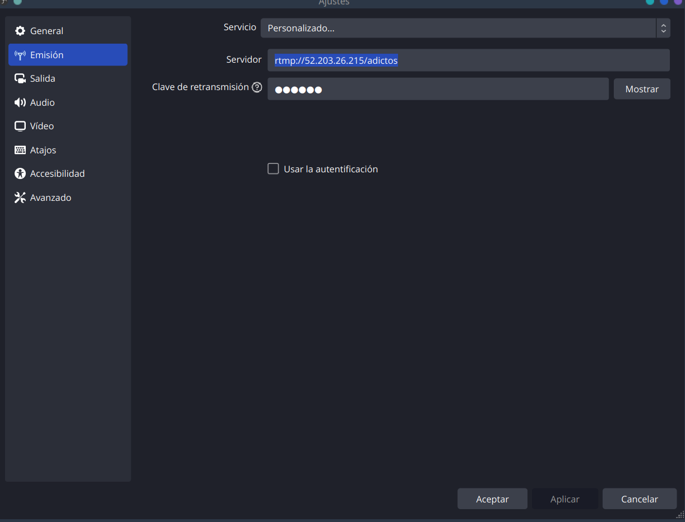
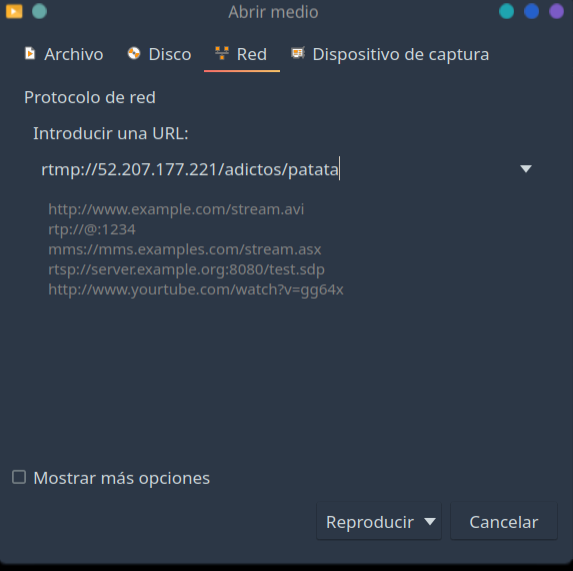
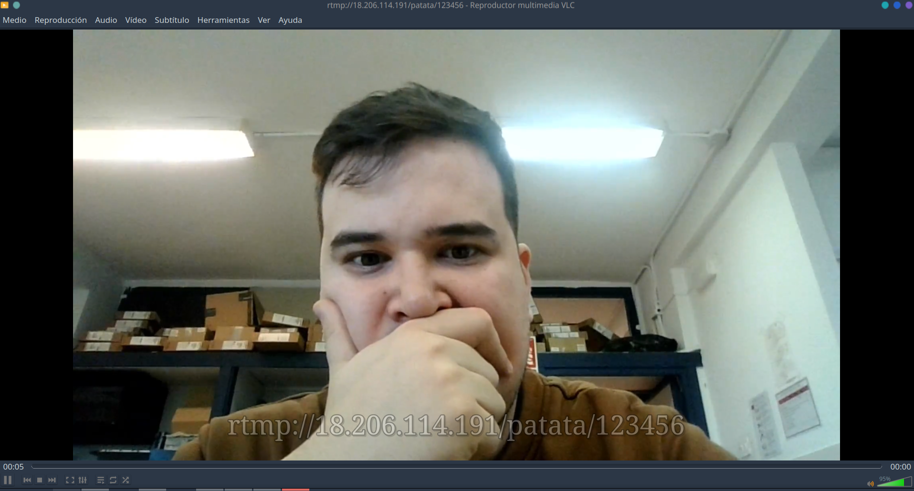
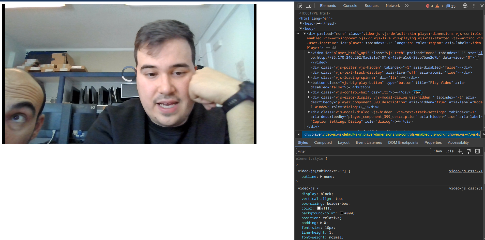

# Reto 5. Servidor Streaming

- Para esta tarea vamos a crear un servidor de streaming que emita a traves de OBS y reproduzca por VLC Player.

## 1. Instalar NGINX 

```bash
    sudo apt update
    sudo apt install nginx
```

## 2. Instalar modulo RTMP

```bash
    apt install libnginx-mod-rtmp
```

## 3. Configurar modulo RTMP

En **/etc/nginx/nginx.conf** añadimos la configuración del RTMP.

```bash
rtmp {
    server {
        listen 1935;
        application patata {
            live on;
            record off;
        }
    }
}
```

Reiniciamos el servicio y comprobamos.

## Configurar OBS

Entramos en OBS Studio a AJUSTES/EMISION y rellenamos los datos del servidor.

```txt
Servidor: rtmp://52.203.26.215/patata
Clave de retransmision: 123456
```



Con esto podremos iniciar la retransmisión

## Iniciar emisión en VLC

Entramos a VLC y **Abrir ubicación de red**

Insertamos 
```rtmp://18.206.114.191/patata/123456```



Y ya tendríamos nuestro servicio de streaming



## Servidor en página WEB

Después de comprobar que funciona el servidor de streaming. Ahora vamos a integrarlo dentro de una página WEB.

Volvemos al **nginx.conf** y añadimos esta configuración.

```bash
rtmp {
        server {
        listen 1935;
        application patata {
                live on;
                #record off;
                #Añadimos HLS
                hls_on;
                hls_path /tmp;
                hls_fragment 3;
                hls_playlist_length 60;
                # disable consuming the stream from nginx as rtmp
                dent play all;
        }
    }
}
```

Creamos el directorio /mnt/hls


nginx.conf

```bash
user www-data;
worker_processes auto;
pid /run/nginx.pid;
include /etc/nginx/modules-enabled/*.conf;

events {
        worker_connections 768;
        # multi_accept on;
}

rtmp {
    server {
        listen 1935;
        application patata {
            live on;
            hls on;
            hls_path /var/www/html/hls/;
            hls_fragment 3;
            hls_playlist_length 60;
            # disable consuming the stream from nginx as rtmp
            deny play all;
        }
    }
}

http {

        ##
        # Basic Settings
        ##

        sendfile on;
        tcp_nopush on;
        types_hash_max_size 2048;
        # server_tokens off;

        # server_names_hash_bucket_size 64;
        # server_name_in_redirect off;

        include /etc/nginx/mime.types;
        default_type application/octet-stream;

        ##
        # SSL Settings
        ##

        ssl_protocols TLSv1 TLSv1.1 TLSv1.2 TLSv1.3; # Dropping SSLv3, ref: POODLE
        ssl_prefer_server_ciphers on;

        ##
        # Logging Settings
        ##

        access_log /var/log/nginx/access.log;
        error_log /var/log/nginx/error.log;

        ##
        # Gzip Settings
        ##

        gzip on;

        # gzip_vary on;
        # gzip_proxied any;
        # gzip_comp_level 6;
        # gzip_buffers 16 8k;
        # gzip_http_version 1.1;
        # gzip_types text/plain text/css application/json application/javascript text/xml application/xml application/xml+rss text/javascript;

        ##
        # Virtual Host Configs
        ##

        include /etc/nginx/conf.d/*.conf;
        include /etc/nginx/sites-enabled/*;
        server{
                listen 80;
                location /hls {
                        # Disable cache
            add_header 'Cache-Control' 'no-cache';

            # CORS setup
            add_header 'Access-Control-Allow-Origin' '*' always;
            add_header 'Access-Control-Expose-Headers' 'Content-Length';

            # allow CORS preflight requests
            if ($request_method = 'OPTIONS') {
                add_header 'Access-Control-Allow-Origin' '*';
                add_header 'Access-Control-Max-Age' 1728000;
                add_header 'Content-Type' 'text/plain charset=UTF-8';
                add_header 'Content-Length' 0;
                return 204;
        }
        }
}


#mail {
#       # See sample authentication script at:
#       # http://wiki.nginx.org/ImapAuthenticateWithApachePhpScript
#
#       # auth_http localhost/auth.php;
#       # pop3_capabilities "TOP" "USER";
#       # imap_capabilities "IMAP4rev1" "UIDPLUS";
#
#       server {
#               listen     localhost:110;
#               protocol   pop3;
#               proxy      on;
#       }
#
#       server {
#               listen     localhost:143;
#               protocol   imap;
#               proxy      on;
#       }
#}
}

```

index.html

```bash
<!DOCTYPE html>
<html lang="en">
<head>
    <meta charset="UTF-8">
    <meta name="viewport" content="width=device-width, initial-scale=1.0">
    <meta http-equiv="X-UA-Compatible" content="ie=edge">
    <title>Player - Live 🔴</title>

    <link href="https://vjs.zencdn.net/7.5.4/video-js.css" rel="stylesheet">
    <script src='https://vjs.zencdn.net/7.5.4/video.js'></script>
</head>
<body>
    <video id="player" class="video-js vjs-default-skin" width="800" height="440"  controls preload="none">
        <source src="http://35.170.246.202:80/hls/123456.m3u8" type="application/x-mpegURL" />
    </video>  
    <script>
        var player = videojs('#player')
    </script>
</body>
</html>
```


