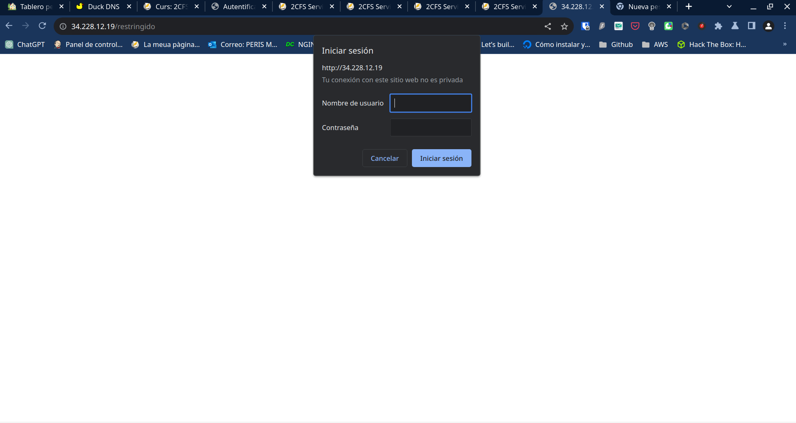
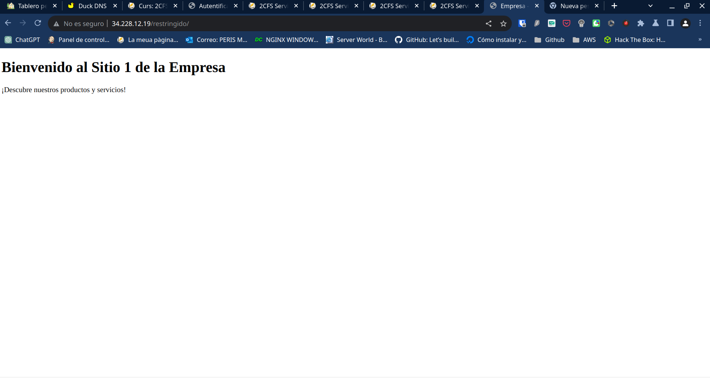

# Reto 1. Web de la empresa

Crearemos una web de la empresa en la que haremos que funciona un apartado digest que tiene un apartado reservado oculto por usuario y contraseña.

Habilitamos el digest

```bash
a2enmod auth_digest
systemctl restart apache2
```

**empresa.conf**

```bash
<VirtualHost *:80>
        # The ServerName directive sets the request scheme, hostname and port that
        # the server uses to identify itself. This is used when creating
        # redirection URLs. In the context of virtual hosts, the ServerName
        # specifies what hostname must appear in the request's Host: header to
        # match this virtual host. For the default virtual host (this file) this
        # value is not decisive as it is used as a last resort host regardless.
        # However, you must set it for any further virtual host explicitly.
        ServerName www.empresa.com

        ServerAdmin webmaster@localhost
        DocumentRoot /var/www/empresa

        # Available loglevels: trace8, ..., trace1, debug, info, notice, warn,
        # error, crit, alert, emerg.
        # It is also possible to configure the loglevel for particular
        # modules, e.g.
        #LogLevel info ssl:warn

        ErrorLog ${APACHE_LOG_DIR}/error.log
        CustomLog ${APACHE_LOG_DIR}/access.log combined

        # For most configuration files from conf-available/, which are
        # enabled or disabled at a global level, it is possible to
        # include a line for only one particular virtual host. For example the
        # following line enables the CGI configuration for this host only
        # after it has been globally disabled with "a2disconf".
        #Include conf-available/serve-cgi-bin.conf
<Directory "/var/www/empresa/restringido">
        AuthType Digest
        AuthName "restringido"
        AuthUserFile "/etc/apache2/contra.digest"
        Require valid-user
</Directory>

</VirtualHost>

# vim: syntax=apache ts=4 sw=4 sts=4 sr noet
```

Configuramos la contraseña
```bash
htdigest -c /etc/claves/contra.digest restringido paco
```

Ahora probamos que funciona




